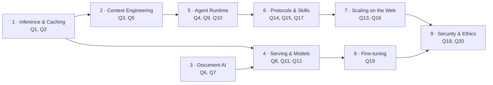

# GenAI Engineering Field Guide

**Production-grade answers to the questions that actually come up when you build, serve, and secure LLM systems.**

Not interview flash cards. Each topic is explained the way a senior AI engineer or data scientist would explain it to a teammate: the intuition, how it works under the hood, diagrams, worked numbers, code you can adapt, the pitfalls people hit in production — and then a 30-second summary at the end.

> **Freshness:** content verified against public specs and docs as of **October 2026**. Fast-moving items (MCP spec revisions, provider pricing, vLLM flags, protocol versions) are flagged in the text — always check the linked sources before relying on exact numbers.

---

## How every answer is structured

| Section | Purpose |
|---|---|
| **What's actually being asked** | The real skill or understanding behind the question |
| **TL;DR** | The answer in a few lines |
| **How it works** | Mechanism, with Mermaid diagrams (render natively on GitHub) |
| **Numbers / code** | Worked examples, formulas, runnable snippets |
| **Pitfalls** | What breaks in production |
| **If you have 30 seconds** | A crisp spoken summary |
| **References** | Papers, specs, docs for going deeper |

---

## All 20 questions

| # | Question | Chapter |
|---|---|---|
| 1 | [What is prefix caching, how does it work and help?](chapters/01-inference-caching-and-cost.md#q1-what-is-prefix-caching-how-does-it-work-and-how-does-it-help) | Ch 1 · Inference & Caching |
| 2 | [Should we always aim for 100% prefix caching? Cached prefill vs decode cost](chapters/01-inference-caching-and-cost.md#q2-should-we-always-go-for-100-prefix-caching-on-every-turn-how-does-discounted-prefill-cost-scale-against-decode) | Ch 1 · Inference & Caching |
| 3 | [What is context bloat and how to prevent it?](chapters/02-context-engineering.md#q3-what-is-context-bloat-and-how-do-we-prevent-it) | Ch 2 · Context Engineering |
| 4 | [Agent shell + isolated workspace without a root Docker daemon (or Docker at all)](chapters/05-agent-runtime-sandboxing.md#q4-how-do-you-give-an-agent-its-own-shell-and-isolated-workspace--without-a-root-docker-daemon-or-without-docker-at-all) | Ch 5 · Agent Runtime |
| 5 | [How to handle compaction](chapters/02-context-engineering.md#q5-how-do-you-handle-compaction) | Ch 2 · Context Engineering |
| 6 | [Handling huge tables and splitting large PDFs](chapters/03-document-ai-pdfs-tables-ocr.md#q6-how-do-you-handle-huge-tables-and-how-do-you-split-large-pdfs) | Ch 3 · Document AI |
| 7 | [What DPI for a VLM OCR batch?](chapters/03-document-ai-pdfs-tables-ocr.md#q7-what-dpi-should-you-use-for-a-vlm-ocr-batch) | Ch 3 · Document AI |
| 8 | [Serving your own model with vLLM (on-prem / cloud GPU)](chapters/04-model-serving-quantization-moe.md#q8-how-do-you-serve-your-own-model-with-vllm-on-prem-or-cloud-gpu) | Ch 4 · Serving & Models |
| 9 | [Repo-level awareness for coding agents in pseudo-isolated directories](chapters/05-agent-runtime-sandboxing.md#q9-how-do-coding-agents-maintain-repo-level-awareness-while-working-in-pseudo-isolated-directories-or-files) | Ch 5 · Agent Runtime |
| 10 | [How browser use and computer use work](chapters/05-agent-runtime-sandboxing.md#q10-how-do-browser-use-and-computer-use-work) | Ch 5 · Agent Runtime |
| 11 | [What is quantization? VRAM estimate for a 7B Q8 model](chapters/04-model-serving-quantization-moe.md#q11-what-is-quantization-given-a-7b-q8-model-estimate-the-vram-required) | Ch 4 · Serving & Models |
| 12 | [MoE vs Dense — which to use when](chapters/04-model-serving-quantization-moe.md#q12-moe-vs-dense--which-one-to-use-when) | Ch 4 · Serving & Models |
| 13 | [SSE — how to scale it](chapters/07-scaling-agents-sse-runtimes.md#q13-sse--how-do-you-scale-it) | Ch 7 · Scaling on the Web |
| 14 | [MCP client–server handshake, request cycle, termination](chapters/06-protocols-mcp-a2a-acp-skills.md#q14-mcp-clientserver-handshake-request-cycle-and-termination) | Ch 6 · Protocols & Skills |
| 15 | [ACP vs A2A](chapters/06-protocols-mcp-a2a-acp-skills.md#q15-acp-vs-a2a) | Ch 6 · Protocols & Skills |
| 16 | [Python vs TypeScript/Bun vs Go for web agents on a 1-CPU server](chapters/07-scaling-agents-sse-runtimes.md#q16-python-vs-typescript-bun-vs-go-for-web-agents--memory-and-throughput-bottlenecks-on-a-1-cpu-server) | Ch 7 · Scaling on the Web |
| 17 | [What are Skills and how to create custom ones](chapters/06-protocols-mcp-a2a-acp-skills.md#q17-what-are-skills-and-how-do-you-create-custom-skills) | Ch 6 · Protocols & Skills |
| 18 | [Preventing prompt injection attacks](chapters/09-security-privacy-ethics.md#q18-how-do-you-prevent-prompt-injection-attacks) | Ch 9 · Security & Ethics |
| 19 | [LoRA, QLoRA and Mixture of Adapters](chapters/08-fine-tuning-lora-qlora-moa.md#q19-lora-qlora-and-mixture-of-adapters) | Ch 8 · Fine-tuning |
| 20 | [AI ethics and sanitizing sensitive user data from prompts](chapters/09-security-privacy-ethics.md#q20-ai-ethics-and-sanitizing-sensitive-user-data-from-prompts) | Ch 9 · Security & Ethics |

---

## Chapters



| Chapter | Topics | Questions |
|---|---|---|
| [1 · Inference, Prefix Caching & Cost](chapters/01-inference-caching-and-cost.md) | Prefill vs decode, KV cache, vLLM APC, RadixAttention, provider caching, cost modelling | Q1, Q2 |
| [2 · Context Engineering](chapters/02-context-engineering.md) | Context bloat, tool-output shaping, sub-agents, compaction strategies | Q3, Q5 |
| [3 · Document AI](chapters/03-document-ai-pdfs-tables-ocr.md) | PDF splitting & stitching, huge tables → SQL, DPI and visual tokens | Q6, Q7 |
| [4 · Serving, Quantization & MoE](chapters/04-model-serving-quantization-moe.md) | vLLM capacity planning & deployment, quantization math, VRAM estimation, MoE vs dense | Q8, Q11, Q12 |
| [5 · Agent Runtime](chapters/05-agent-runtime-sandboxing.md) | Sandboxes without root Docker, repo awareness, browser & computer use | Q4, Q9, Q10 |
| [6 · Protocols & Skills](chapters/06-protocols-mcp-a2a-acp-skills.md) | MCP (legacy and stateless 2026-07-28), A2A vs ACP, Agent Skills | Q14, Q15, Q17 |
| [7 · Scaling Agents on the Web](chapters/07-scaling-agents-sse-runtimes.md) | Scaling SSE, Python vs TS/Bun vs Go on one CPU | Q13, Q16 |
| [8 · Fine-tuning](chapters/08-fine-tuning-lora-qlora-moa.md) | LoRA, QLoRA, multi-LoRA serving, mixture of adapters | Q19 |
| [9 · Security, Privacy & Ethics](chapters/09-security-privacy-ethics.md) | Prompt injection defense, PII sanitization, ethics → controls | Q18, Q20 |

Also see: **[GLOSSARY.md](GLOSSARY.md)** for terms used throughout, and **[code/](code/)** for runnable examples.

---

## Suggested reading paths

- **Building agents?** 2 → 1 → 5 → 6 → 9
- **Self-hosting models?** 4 → 1 → 8
- **Document / RAG pipelines?** 3 → 2 → 9
- **Backend / platform engineer?** 7 → 6 → 5 → 4

---

## Repository layout

```text
.
├── README.md
├── GLOSSARY.md
├── CONTRIBUTING.md
├── chapters/
│   ├── 01-inference-caching-and-cost.md
│   ├── 02-context-engineering.md
│   ├── 03-document-ai-pdfs-tables-ocr.md
│   ├── 04-model-serving-quantization-moe.md
│   ├── 05-agent-runtime-sandboxing.md
│   ├── 06-protocols-mcp-a2a-acp-skills.md
│   ├── 07-scaling-agents-sse-runtimes.md
│   ├── 08-fine-tuning-lora-qlora-moa.md
│   └── 09-security-privacy-ethics.md
└── code/
    └── pii_pseudonymizer.py
```

---

## Contributing

Found something outdated or wrong? Have a better diagram or a production war story? PRs welcome — see [CONTRIBUTING.md](CONTRIBUTING.md).
