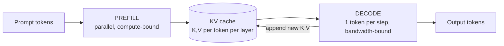
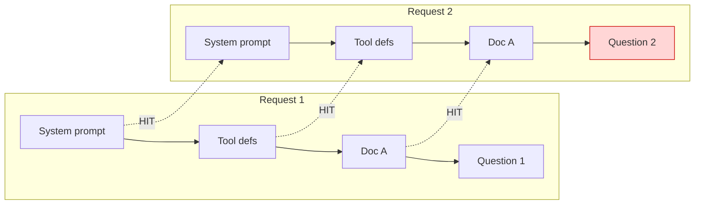
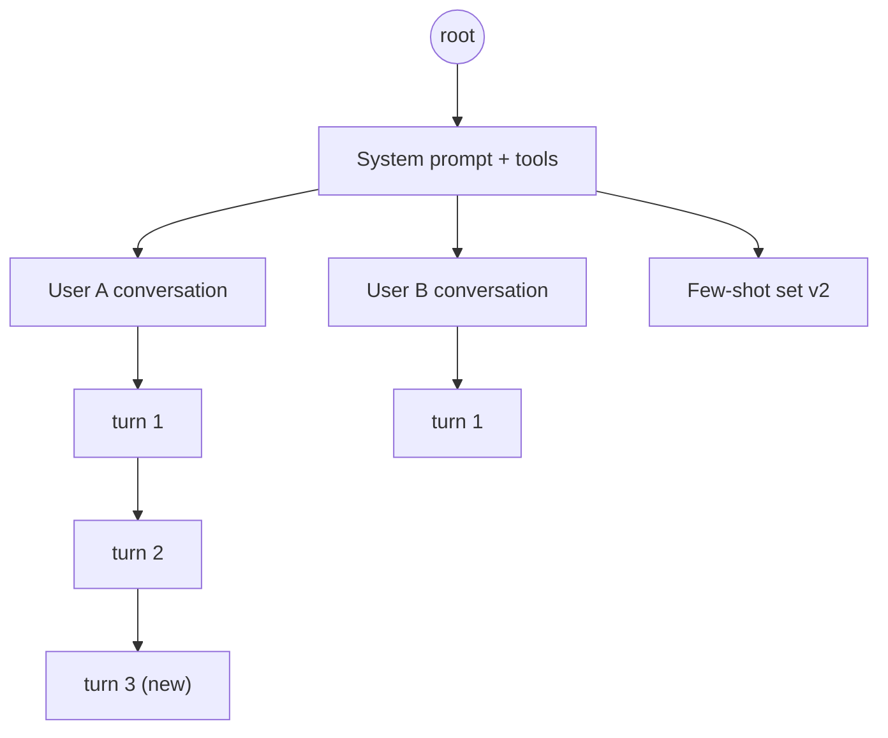
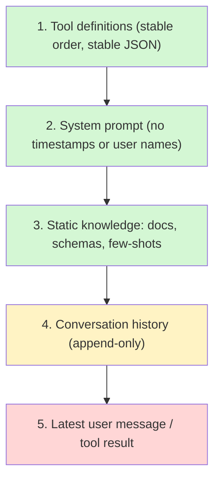
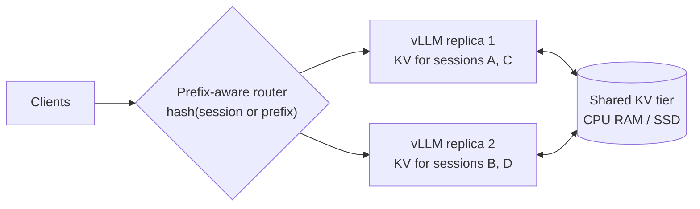
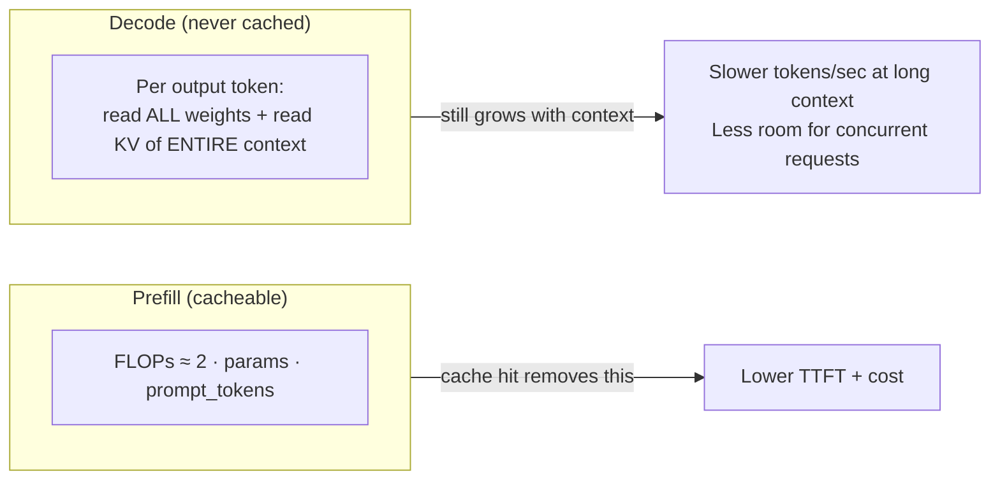
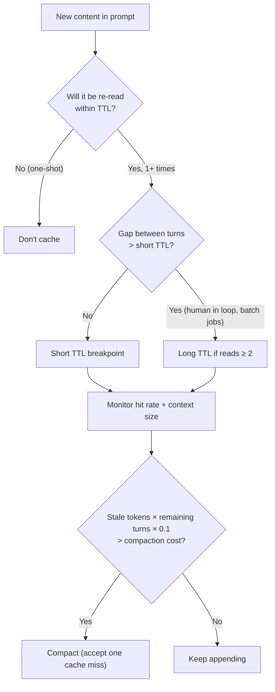

# Chapter 1 — Inference, Prefix Caching & Cost Economics

> Covers **Q1** (what prefix caching is and why it matters) and **Q2** (should you chase 100% cache hits, and how cached prefill compares to decode cost).

[← Back to index](../README.md)

---

## Background you need first: Prefill vs Decode

Every LLM request runs in two very different phases:

| Phase | What happens | Bottleneck | Scales with |
|---|---|---|---|
| **Prefill** | All prompt tokens are processed *in parallel*; the model computes Key/Value (K/V) tensors for every token at every layer | **Compute** (FLOPs) | prompt length |
| **Decode** | Output tokens are generated *one at a time*; each step reads all weights + the whole KV cache | **Memory bandwidth** | output length × context length |

The K/V tensors produced in prefill are stored in the **KV cache** so decode doesn't recompute them. Normally that cache lives only for the lifetime of a single request. **Prefix caching** keeps it alive *across* requests.



---

## Q1. What is prefix caching, how does it work, and how does it help?

> **What's actually being asked:** Do you understand *why* KV can be reused only for an identical prefix, how serving engines (vLLM/SGLang) and API providers implement it, and — most importantly — can you design prompts and infrastructure so you actually get cache hits?

### TL;DR

Prefix caching stores the KV cache computed for a prompt prefix and reuses it when a later request starts with **exactly the same tokens**. Those tokens skip prefill entirely. Result: lower time-to-first-token (TTFT), lower cost (providers discount cached tokens by up to ~90%), and higher GPU throughput.

### Why only an exact *prefix*?

Decoder-only transformers use **causal attention**: the K/V for token *i* depend on tokens *1…i*. So:

- If tokens 1…1000 are identical to a previous request → their KV is identical → reusable.
- If token 5 differs → KV for tokens 5…N is different → everything after the first difference must be recomputed.



Only "Question 2" is prefilled. One changed token early in the prompt (say, a timestamp in the system prompt) turns the entire request into a miss.

### How engines implement it

**vLLM — Automatic Prefix Caching (APC), block hashing.** vLLM stores KV in fixed-size *blocks* (PagedAttention, default 16 tokens/block). Each *full* block gets a hash that chains the parent block's hash, so a block's identity encodes its entire prefix:

```python
# Conceptual — mirrors how vLLM identifies reusable blocks
def block_hashes(token_ids, block_size=16, extra_keys=None):
    hashes, parent = [], None
    for i in range(0, len(token_ids) - block_size + 1, block_size):   # full blocks only
        block = tuple(token_ids[i:i + block_size])
        h = hash((parent, block, extra_keys))   # extra_keys: LoRA id, image hashes, cache salt...
        hashes.append(h)
        parent = h
    return hashes

# On a new request: walk the hashes; every hash found in the block table is a cache hit.
# Stop at the first miss — everything after must be computed.
```

Blocks with zero active references stay in GPU memory and are evicted LRU when space is needed. In vLLM V1 APC is on by default.

**SGLang — RadixAttention.** Keeps all cached sequences in a **radix tree** keyed by tokens. A new request walks the tree as far as it matches. This naturally shares common branches (e.g., one system prompt → many conversations → many turns).



**API providers.** Same idea, packaged differently (verify current numbers on the provider's pricing page — they change):

| Provider | How you opt in | Pricing pattern (as of writing) | Notes |
|---|---|---|---|
| Anthropic | Explicit `cache_control` breakpoints (up to 4) | Cache write ≈ 1.25× base input (5-min TTL) or 2× (1-hour TTL); cache read ≈ 0.1× | TTL refreshes on each hit; minimum cacheable length depends on model |
| OpenAI | Automatic for prompts above ~1K tokens | Cached input discounted (50–90% depending on model) | No write premium; matched in fixed-size increments |
| Google Gemini | Implicit caching + explicit `CachedContent` | Discounted reads; explicit caches also bill storage per hour | Explicit caching good for huge static corpora |

```python
import anthropic

client = anthropic.Anthropic()
MODEL = "your-model-id"

resp = client.messages.create(
    model=MODEL,
    max_tokens=1024,
    system=[
        {"type": "text", "text": STATIC_INSTRUCTIONS_AND_DOCS,       # big + never changes
         "cache_control": {"type": "ephemeral"}},                    # breakpoint here
    ],
    messages=[{"role": "user", "content": user_question}],          # dynamic part last
)

u = resp.usage
print("written to cache:", u.cache_creation_input_tokens,
      "read from cache:", u.cache_read_input_tokens,
      "uncached:", u.input_tokens)
```

### How it helps

1. **Latency (TTFT).** Prefilling 100K tokens can take seconds; a cache hit reduces it to the cost of the uncached tail.
2. **Cost.** Cached tokens are billed at a fraction of normal input price.
3. **Throughput (self-hosted).** Prefill FLOPs that aren't spent on repeated prefixes are available for other requests — often the single biggest throughput lever for agents and chat apps, where 80–95% of each request is repeated history.

### Designing prompts for cache hits — the layout rule

**Most static → most dynamic, top to bottom. Never edit what's above.**



**Common cache killers** (each of these has bitten real production systems):

| Cache killer | Fix |
|---|---|
| `Current time: 2026-10-07 14:03:22` in the system prompt | Put time in the latest user message, or round it to the day |
| Tool list order changes between requests (dict iteration, plugin load order) | Sort tools by name; serialize JSON with sorted keys |
| Dynamically adding/removing tools mid-conversation | Keep tool set fixed per session; use deferred loading via a single "search tools" tool |
| Truncating history **from the front** (sliding window) | Every turn changes the start → 0% hit rate. Use compaction in big steps instead (see Chapter 2) |
| Re-rendering images/attachments with different bytes | Cache the encoded artifact; reuse identical bytes |
| Per-request random IDs or A/B flags in the prompt | Move them to metadata, not prompt text |
| Switching models between turns | Cache is per model; don't hop models within a session unless intended |

### Self-hosted gotcha: cache locality

In a multi-replica deployment, the cache lives in **one GPU's memory**. A round-robin load balancer sends turn 2 to a different replica → miss. Fixes:

- **Prefix-aware / session-affinity routing** (hash the session id or the first N tokens → replica). vLLM's production-stack router, `llm-d`, and the SGLang router support this.
- **KV offloading / sharing tiers** (e.g., LMCache) to spill KV to CPU RAM or SSD and share across instances.



### Measure it

- Anthropic: `cache_creation_input_tokens`, `cache_read_input_tokens` in `usage`
- OpenAI: `usage.prompt_tokens_details.cached_tokens`
- vLLM: Prometheus metrics for prefix-cache queries vs hits on `/metrics`

Track **hit rate = cached tokens / total input tokens** per endpoint. For a well-built agent loop, 85%+ is normal; below 50% usually means a cache killer is in your prompt.

### If you have 30 seconds

> "Prefix caching reuses the KV cache of an identical token prefix across requests, so those tokens skip prefill. Because attention is causal, any change invalidates everything after it — so I order prompts static-to-dynamic, keep tools and system prompts byte-stable, append-only history, and use session-affine routing when self-hosting. It cuts TTFT, input cost by up to ~90%, and frees GPU compute."

---

## Q2. Should we always go for 100% prefix caching on every turn? How does discounted prefill cost scale against decode?

> **What's actually being asked:** Do you understand caching as an *economic* tool with its own costs (write premiums, TTLs, memory), can you model cost across a multi-turn session, and do you realize that once input is cheap, **decode becomes the dominant cost and latency**?

### TL;DR

**No.** 100% is impossible (the newest message is always new) and not even the goal. The goal is: *cache everything that will be read again, nothing that won't.* Writes can cost more than normal input; caches expire; and caching does nothing for decode, which becomes your main cost and latency once prefill is discounted. Sometimes you should *deliberately break* the cache (compaction) because carrying stale context forever costs more.

### The cost model

For turn *t* in a session with context length $C_t$:

$$
\text{Cost}_t = \underbrace{N^{\text{read}}_t \cdot r \cdot p_{in}}_{\text{cached prefix}} + \underbrace{N^{\text{write}}_t \cdot w \cdot p_{in}}_{\text{new tokens cached}} + \underbrace{N^{\text{uncached}}_t \cdot p_{in}}_{\text{rest}} + \underbrace{N^{\text{out}}_t \cdot p_{out}}_{\text{decode}}
$$

where $r \approx 0.1$ (read multiplier), $w \approx 1.25$ (write multiplier, provider-dependent), and typically $p_{out} \approx 4\text{–}5 \times p_{in}$.

Since context grows every turn, **cumulative input cost grows quadratically** with the number of turns ($\sum_t C_t \sim O(T^2)$). Caching doesn't change the shape — it shrinks the constant by ~10×.

### Worked example (illustrative prices: $3/M input, $15/M output)

Agent session: 5K-token system prompt + tools, each turn adds 3K tokens (user message + tool results), 400 output tokens per turn.

| Turn | Context | Cumulative input cost, **no cache** | Cumulative input cost, **cached** | Cumulative output cost | Output share (no cache) | Output share (cached) |
|---|---|---|---|---|---|---|
| 1 | 8K | $0.024 | $0.030 | $0.006 | 20.0% | 16.7% |
| 5 | 20K | $0.210 | $0.090 | $0.030 | 12.5% | 25.0% |
| 10 | 35K | $0.645 | $0.185 | $0.060 | 8.5% | 24.5% |
| 20 | 65K | $2.190 | $0.443 | $0.120 | 5.2% | 21.3% |
| 30 | 95K | $4.635 | $0.791 | $0.180 | 3.7% | 18.5% |

Three lessons from this table:

1. **Turn 1 is *more expensive* with caching** ($0.030 vs $0.024) — you paid the write premium and haven't read anything back yet. Caching a one-shot prompt is a loss.
2. **By turn 30, caching cuts input cost ~6×.** That's the quadratic term being tamed.
3. **Output's share of the bill jumps from ~4% to ~19%.** Once prefill is cheap, decode is what you're paying for — and what you're waiting on.

### Break-even: when does a cache write pay off?

With write multiplier $w$ and read multiplier $r$, caching beats not caching after $n$ reads when:

$$
w + n\cdot r < 1 + n \quad\Rightarrow\quad n > \frac{w-1}{1-r}
$$

| TTL option | $w$ | Reads needed to break even |
|---|---|---|
| Short TTL (≈1.25×) | 1.25 | **1 read** (0.28 → round up) |
| Long TTL (≈2×) | 2.0 | **2 reads** (1.11 → round up) |

So: cache anything you'll hit **at least once** (short TTL) or **at least twice** (long TTL) within the TTL window.

### Why decode doesn't get the discount — the physics



Even with a 100% prefix hit, every decode step **attends over the full context**. Long cached contexts therefore:

- **Slow down decode** (attention reads grow linearly with context).
- **Occupy KV memory.** An 8B model with grouped-query attention (32 layers × 8 KV heads × 128 head dim, FP16) uses **128 KiB per token**. A 100K-token context = **~12 GiB of KV per sequence**. On an 80 GB GPU holding ~16 GB of weights, that's only ~5 concurrent long sessions.

> **Caching makes long context cheap to *read in*. It does not make it cheap to *hold* or to *generate against*.**

Latency tells the same story: a cached 95K prefill might take a few hundred ms, but 400 output tokens at 50–100 tok/s take 4–8 seconds. Users feel decode.

### When to deliberately break the cache

Carrying stale tokens costs $\text{stale} \times r \times p_{in}$ **every turn, forever**. Compacting costs a one-time re-write of a much smaller context plus the summarization call.

**Example:** 80K stale tokens, compacted down to 8K.

- Saving per turn ≈ 72K × 0.1 = **7.2K input-token-equivalents**
- One-time cost ≈ 8K × 1.25 (re-write) + 8K (cached read of 80K during summarization) + 2K output × 5 (summary decode) ≈ **28K equivalents**
- **Break-even ≈ 4 turns.** If the session will continue longer than that, compact.

And that ignores the *quality* benefit of removing stale context (see Chapter 2).

### Practical strategy



Concrete rules:

1. **One breakpoint on the static block** (tools + system + docs) and **one moving breakpoint at the end of the latest turn** in agent loops. Providers have a limited look-back window for finding earlier hits, so don't rely on a single breakpoint far back.
2. **Don't cache one-shot prompts** (classification jobs with unique inputs, etc.) when there's a write premium — unless the shared prefix (instructions + few-shots) is reused across the batch, in which case cache *that* part.
3. **Mind the TTL vs user think-time.** If users pause > 5 minutes, the short TTL expires and you pay the full prefill again.
4. **Optimize decode separately:** shorter outputs (structured output, "answer concisely"), smaller/faster models for sub-steps, speculative decoding when self-hosting, and streaming to hide latency.
5. **Budget the whole loop, not the turn.** Track cost per *task completed*, not per request.

### If you have 30 seconds

> "No. Cache writes can carry a premium, so caching only pays when content is re-read within the TTL — once for short TTLs, twice for long ones. Input cost across a session grows quadratically; caching cuts the constant ~10× but doesn't touch decode. Once prefill is discounted, output tokens become the dominant cost and latency, and long cached contexts still slow decode and consume KV memory. So I cache the stable prefix, compact when stale context costs more than a one-time miss, and optimize output length separately."

---

## References

- vLLM docs — Automatic Prefix Caching design
- SGLang paper — *Efficiently Programming Large Language Models using SGLang* (RadixAttention)
- Kwon et al., *Efficient Memory Management for LLM Serving with PagedAttention* (2023)
- Anthropic, OpenAI, Google — prompt/context caching documentation and pricing pages (check current values)

[Next: Chapter 2 — Context Engineering →](02-context-engineering.md)
