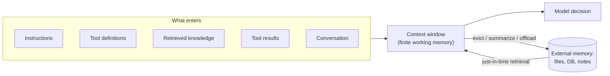
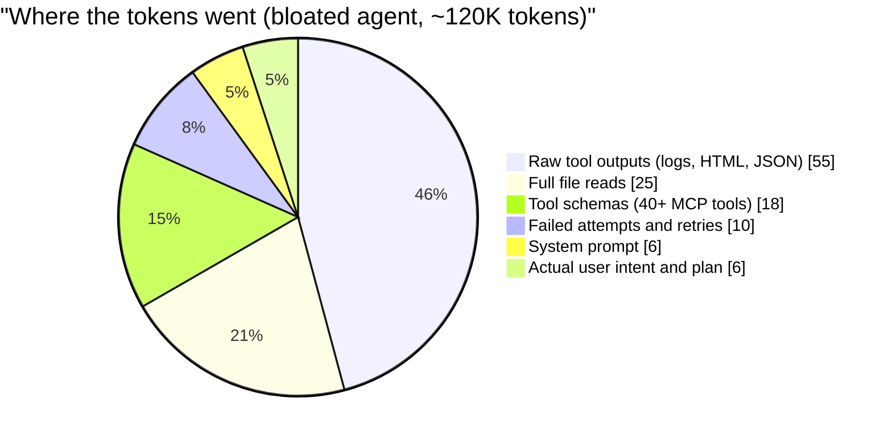
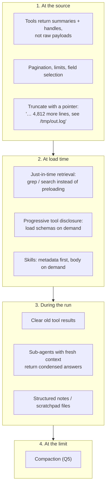
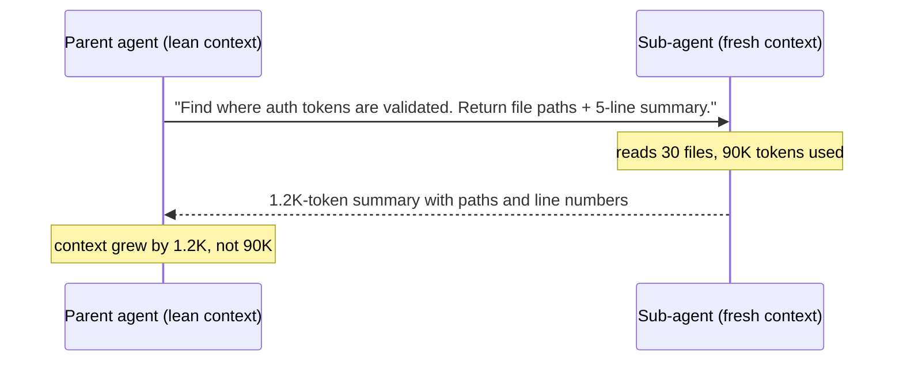
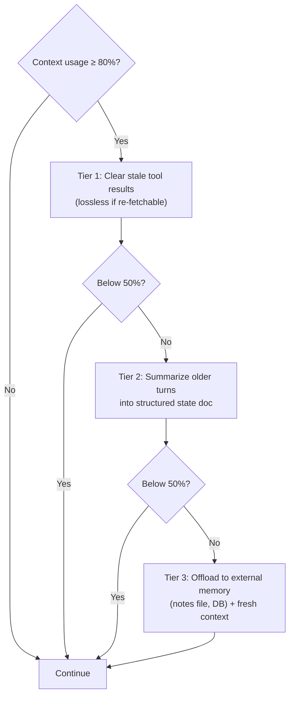
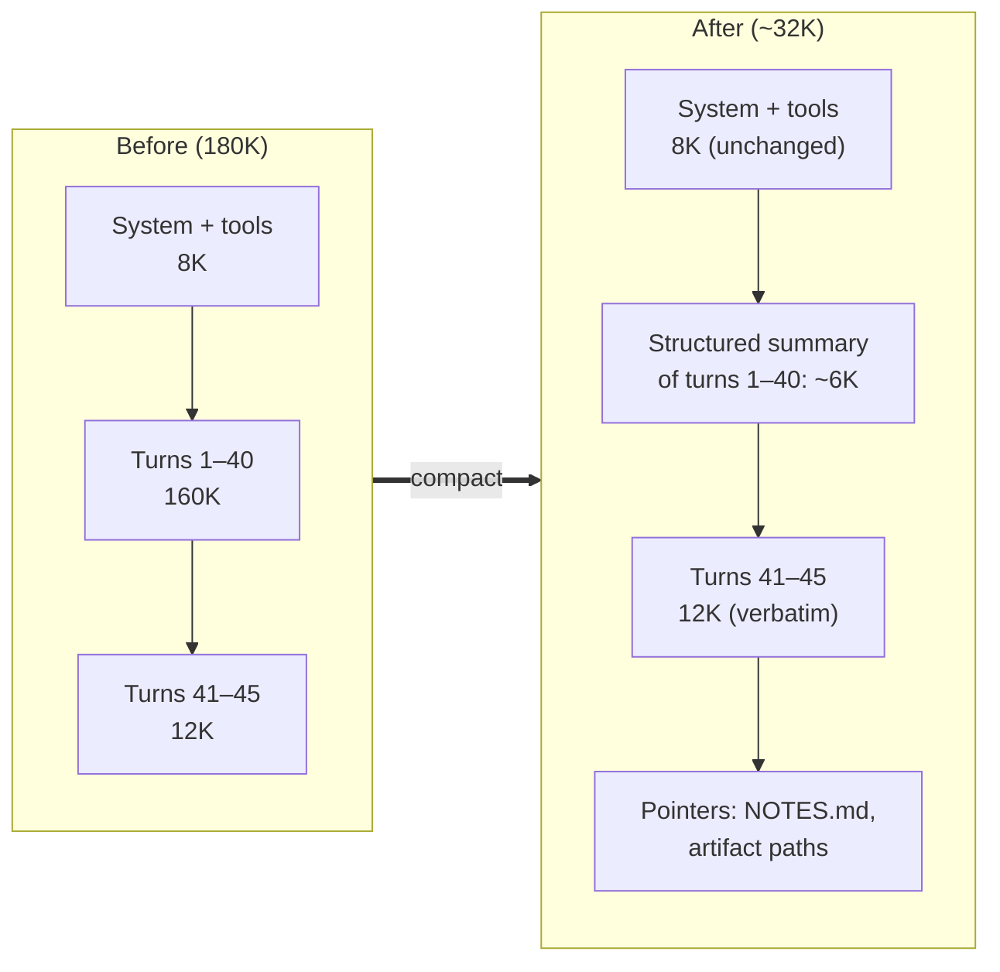

# Chapter 2 — Context Engineering: Bloat & Compaction

> Covers **Q3** (what context bloat is and how to prevent it) and **Q5** (how to handle compaction).

[← Back to index](../README.md)

---

## The core idea

The context window is not storage — it's **working memory**. Every token in it costs money, adds latency, and competes for the model's attention. Context engineering is the discipline of deciding *what goes in, when, in what form, and when it leaves*.



---

## Q3. What is context bloat, and how do we prevent it?

> **What's actually being asked:** Can you identify *where* tokens come from in a real agent, explain why "more context" degrades quality (not just cost), and name concrete architectural patterns — not just "summarize it"?

### TL;DR

Context bloat is the accumulation of tokens that don't help the current decision: giant tool outputs, full-file dumps, dozens of unused tool schemas, stale plans, failed retries. It hurts **cost** (quadratic, see Chapter 1), **latency**, and **accuracy** — models get worse at finding and using relevant information as context grows ("context rot", "lost in the middle"). Prevent it by controlling tokens *at the source*, not just cleaning up afterward.

### Anatomy of a bloated agent context

A typical coding/research agent at turn 25, if nobody is managing it:



Only a small slice is the information that drives the next decision.

### Why bloat hurts quality, not just cost

- **Attention dilution:** relevant facts compete with thousands of irrelevant tokens.
- **Positional effects:** information buried in the middle of long contexts is used less reliably than at the start or end.
- **Distraction and anchoring:** old failed attempts and stale plans pull the model back toward wrong paths ("context poisoning" when an early hallucination keeps getting re-read as fact).
- **Tool confusion:** with 50+ similar tool definitions, tool-selection accuracy drops.

### Prevention playbook — control tokens at every entry point



**1. Shape tool outputs (biggest win).** Treat tool responses as an API designed for an LLM consumer:

```python
MAX_TOOL_CHARS = 8_000

def shape_tool_output(raw: str, artifact_store) -> str:
    """Return something the model can reason over, plus a handle to the rest."""
    if len(raw) <= MAX_TOOL_CHARS:
        return raw
    handle = artifact_store.save(raw)                 # file path, blob id, etc.
    head, tail = raw[:3_000], raw[-2_000:]
    return (
        f"{head}\n\n[... truncated {len(raw) - 5_000:,} chars ...]\n\n{tail}\n\n"
        f"Full output saved at {handle}. Use read_file(path, offset, limit) "
        f"or grep(pattern, path) to inspect specific parts."
    )
```

Other source-level controls: return only requested fields (`fields=["id","status"]`), default `limit=20` with pagination, strip HTML to text/markdown, deduplicate repeated log lines, return error *messages* not entire stack dumps (or the last frames only).

**2. Retrieve just-in-time, don't preload.** Instead of stuffing a whole codebase or document set into the prompt, give the agent `glob`, `grep`, `read_file(offset, limit)`, and search tools. It pulls exactly what it needs, when it needs it. Lightweight *identifiers* (paths, URLs, IDs) are cheap to keep in context; contents are not.

**3. Progressive tool disclosure.** Connecting several MCP servers can easily put tens of thousands of tokens of tool schemas in every request. Options:

- Expose a single `search_tools(query)` meta-tool; load the matched schemas on demand.
- Group tools by task and load a group only when that task starts.
- Use Skills (Chapter 6), which keep only name + description in context until needed.

**4. Clear stale tool results.** Once a tool result has been "used" (the agent acted on it several turns ago), replace it with a stub: `[result of read_file('app.py') cleared — re-read if needed]`. This is lossless as long as the data can be re-fetched. Some providers now offer server-side context editing that does this automatically — check your provider's docs.

**5. Sub-agents as context firewalls.** Delegate exploratory work (search 40 files, read 10 web pages) to a sub-agent with a fresh context. It burns 100K tokens exploring and returns a 1–2K token distilled answer. The parent's context only grows by the answer.



**6. Structured note-taking (external memory).** Have the agent maintain a `NOTES.md` / `progress.json`: goal, decisions, open TODOs, known pitfalls. It can re-read this after compaction or in a new session — memory that survives context resets.

**7. Budget and observe.** Log the token composition of each request (system / tools / history / tool-results / new). You can't fix bloat you can't see. Set alarms like "tool results > 50% of context" or "single tool output > 10K tokens".

### Pitfalls

- **Summarizing too eagerly** loses exact details (file paths, error strings, IDs) the agent needs later. Prefer clearing re-fetchable content over summarizing unique content.
- **Cleaning in ways that break the prompt cache every turn.** Editing history near the top on every turn turns a 90% hit rate into 0%. Batch cleanup into infrequent, large steps.
- **Hiding truncation.** If you cut output silently, the model will assume it saw everything. Always say what was cut and how to get it.

### If you have 30 seconds

> "Context bloat is low-value tokens accumulating in the window — raw tool outputs, file dumps, unused tool schemas, failed retries. It costs money and latency, but more importantly degrades accuracy through attention dilution and stale information. I prevent it at the source: tools return summaries plus handles, just-in-time retrieval instead of preloading, progressive tool loading, sub-agents as context firewalls, clearing stale tool results, and external notes — with compaction as the last resort."

---

## Q5. How do you handle compaction?

> **What's actually being asked:** Do you have a concrete *policy* — when to trigger, what to keep verbatim, what to summarize, how to preserve correctness and cache efficiency — and do you know the failure modes (amnesia, lost identifiers, summary drift)?

### TL;DR

Compaction rewrites the conversation history into a smaller form when the context nears its limit. Do it in **tiers** (cheapest/lossless first), trigger with **hysteresis** (e.g., at 75–80%, compact down to ~30–40%) so it's rare, keep the **system prompt + tools + recent turns verbatim**, and summarize the middle into a **structured** state document that preserves exact identifiers. Persist key state to external memory so nothing critical lives only in the summary.

### The tiered approach



### What the compacted context looks like



Key choices:

- **Never summarize the system prompt or tool definitions.** They're the cached, authoritative prefix.
- **Keep the last N turns verbatim** (N ≈ 3–10). The model needs the exact recent state.
- **Summarize the middle with a template**, not free-form prose.

### A summary template that works

Free-form "summarize the conversation" produces vague prose and loses the details agents actually need. Use a structured prompt:

```text
You are compacting an agent's working history. Produce a state document with
EXACTLY these sections. Preserve identifiers verbatim (file paths, function
names, URLs, IDs, commands, error messages). Do not invent anything.

## Goal
The user's original objective and any refinements they made.

## Constraints & preferences
Explicit user requirements (style, libraries, "don't touch X", deadlines).

## Decisions made (and why)
- Decision — reason — turn it was made

## Current state
What is done, what is in progress, what files/resources were changed.

## Key facts discovered
Facts needed later (config values, schema shapes, API quirks), with sources.

## Failed approaches (do not retry)
- Approach — why it failed (exact error if relevant)

## Open TODOs / next step
The immediate next action and remaining tasks in order.
```

The "Failed approaches" section is the most underrated — without it, agents happily retry the same broken fix after compaction.

### Implementation sketch

```python
COMPACT_AT = 0.80     # trigger
TARGET     = 0.40     # aim to land here (hysteresis keeps compaction rare)
KEEP_LAST  = 6        # verbatim recent turns

def maybe_compact(ctx, limit, llm, memory):
    if ctx.token_count() < COMPACT_AT * limit:
        return ctx

    # Tier 1: clear stale, re-fetchable tool results
    ctx = clear_tool_results(ctx, older_than_turns=5, keep_ids=ctx.pinned_ids)
    if ctx.token_count() < TARGET * limit:
        return ctx

    # Tier 2: structured summary of the middle
    head   = ctx.system_and_tools()           # untouched, cached prefix
    middle = ctx.turns[:-KEEP_LAST]
    recent = ctx.turns[-KEEP_LAST:]
    summary = llm.complete(COMPACTION_TEMPLATE, history=middle)

    # Verify: every identifier in recent decisions must survive
    missing = find_identifiers(middle) - find_identifiers(summary)
    if critical(missing):
        summary += "\n\n## Preserved identifiers\n" + "\n".join(sorted(missing))

    memory.write("NOTES.md", summary)          # Tier 3: survives even a full reset
    return ctx.rebuild(head, [summary_message(summary)], recent)
```

### Cache-aware compaction

Compaction invalidates the cached prefix from the summary onward (Chapter 1, Q2). That's fine if it's rare:

- **Hysteresis** — compacting from 80% down to 40% means it happens once per large chunk of work, not every turn.
- **Never use sliding-window truncation from the front.** It's a cache miss on every single turn.
- **Run the summarization call on the existing cached context** (append the compaction instruction as a new message) so the summarizer's own input is mostly cache reads.

### Alternatives and complements

| Technique | Lossless? | Cost | Best for |
|---|---|---|---|
| Clear old tool results | Yes, if re-fetchable | ~free | Agents with heavy tool I/O |
| Structured summary | No | One LLM call | Long multi-step tasks |
| Hierarchical/rolling summaries | No | Periodic calls | Very long sessions (chat companions, support) |
| External notes/memory files | Yes (explicit) | Tool calls | Multi-session work, agents that must "resume" |
| Sub-agent isolation | N/A (prevents growth) | Extra calls | Exploration-heavy subtasks |
| Fresh session + handoff doc | Partial | One call | Very long coding tasks; "start clean, read NOTES.md" |

### Failure modes to test for

1. **Amnesia of constraints:** after compaction the agent violates a user rule stated at turn 3. → Constraints section + eval case.
2. **Identifier drift:** `src/auth/jwt_utils.py` becomes "the JWT helper file". → Identifier preservation check.
3. **Retry loops:** re-attempts a known-failed approach. → "Failed approaches" section.
4. **Summary hallucination:** summary claims something was done that wasn't. → Instruct "do not invent"; cross-check with tool logs (e.g., git diff) where possible.
5. **Compaction storms:** context hovers near the threshold and compacts every turn. → Hysteresis.

Build a small eval: take long recorded sessions, compact at turn N, then ask questions whose answers are only in turns 1…N. Measure retention.

### If you have 30 seconds

> "I compact in tiers: first clear stale tool results, which is lossless if they're re-fetchable; then summarize older turns into a structured state document — goal, constraints, decisions, current state, failed approaches, next steps — preserving exact identifiers; and persist that to an external notes file. I keep the system prompt, tools, and last several turns verbatim, trigger at ~80% and compact to ~40% so it's rare and cache-friendly, and eval for retention of constraints and identifiers."

---

## References

- Anthropic engineering blog — *Effective context engineering for AI agents*
- Liu et al., *Lost in the Middle: How Language Models Use Long Contexts* (2023)
- Chroma research — *Context Rot* (long-context degradation study)
- Provider docs on context editing / server-side compaction (check current availability)

[← Chapter 1](01-inference-caching-and-cost.md) · [Next: Chapter 3 — Document AI →](03-document-ai-pdfs-tables-ocr.md)
