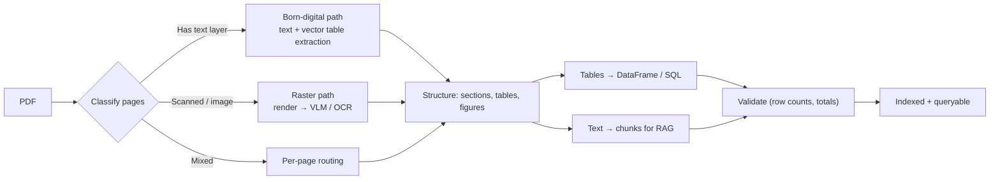
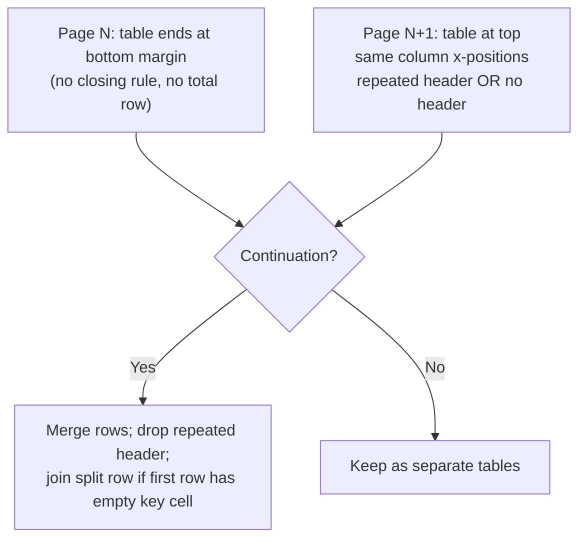
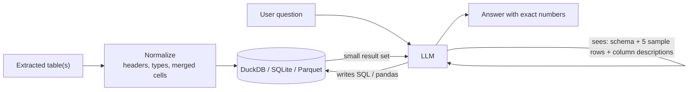
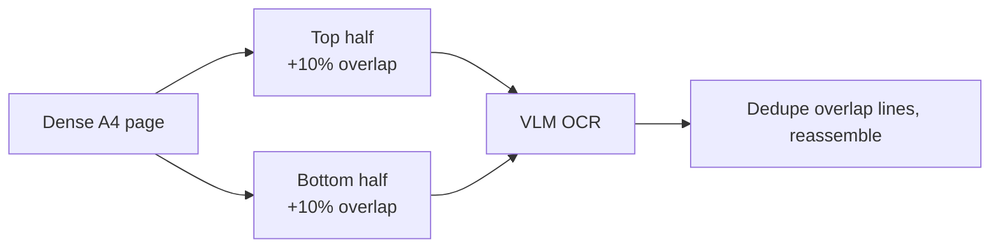

# Chapter 3 — Document AI: Huge Tables, PDF Splitting & OCR Resolution

> Covers **Q6** (handling huge tables and splitting PDFs) and **Q7** (choosing DPI for VLM-based OCR in batches).

[← Back to index](../README.md)

---

## The pipeline at a glance



Two principles drive everything in this chapter:

1. **Don't use a VLM when the PDF already contains the text.** Born-digital PDFs have a text layer; extracting it is faster, cheaper, and exact.
2. **Tables are data, not text.** Big tables belong in a DataFrame/database the LLM *queries*, not in the prompt.

---

## Q6. How do you handle huge tables, and how do you split large PDFs?

> **What's actually being asked:** Have you dealt with real-world documents — 500-page reports, tables spanning 30 pages, merged headers, scanned annexures? Do you know that naive fixed-size splitting breaks tables and sections, and that stuffing a 10K-row table into a prompt is the wrong abstraction?

### TL;DR

- **Splitting:** classify pages first (digital vs scanned), split along **logical boundaries** (outline/bookmarks, headings) rather than fixed page counts, process page batches in parallel, and run a **stitching pass** that merges tables and paragraphs that cross page breaks.
- **Huge tables:** extract to a structured format (CSV/Parquet/SQL), carry headers across pages, normalize merged/multi-level headers, then let the LLM **query** the table via SQL/pandas tools. For RAG, chunk by rows with headers repeated in every chunk.

### Part A — Splitting PDFs properly

**Step 1: Classify each page.**

```python
import pymupdf  # PyMuPDF (import name was "fitz" in older versions)

def classify_pages(path, min_chars=50):
    doc = pymupdf.open(path)
    kinds = []
    for page in doc:
        text = page.get_text("text").strip()
        img_area = sum(
            (b[2] - b[0]) * (b[3] - b[1])
            for b in (page.get_image_bbox(i) for i in page.get_images(full=True))
            if b.is_valid
        ) if page.get_images() else 0
        page_area = page.rect.width * page.rect.height
        if len(text) >= min_chars:
            kinds.append("digital")
        elif img_area > 0.5 * page_area:
            kinds.append("scanned")
        else:
            kinds.append("blank_or_graphic")
    return kinds
```

**Step 2: Choose split boundaries — logical, not fixed.**

| Strategy | When to use | Downside |
|---|---|---|
| Fixed N pages | Quick parallelism for OCR | Cuts tables and sections mid-way |
| Fixed N pages **+ 1 page overlap** | OCR batches where stitching is planned | Duplicate content to dedupe |
| PDF outline / bookmarks (`doc.get_toc()`) | Reports, manuals, filings | Not all PDFs have an outline |
| Heading detection (font size/weight) | No outline, consistent styling | Needs tuning per document family |
| Table-aware: never split inside a detected table span | Financial statements, annexures | Requires table detection first |

```python
def split_by_outline(path, max_pages=40):
    """Split into chunks on top-level bookmarks; fall back to fixed size."""
    doc = pymupdf.open(path)
    toc = [(lvl, title, page - 1) for lvl, title, page in doc.get_toc() if lvl == 1]
    starts = [p for _, _, p in toc] or list(range(0, doc.page_count, max_pages))
    starts = sorted(set(starts + [doc.page_count]))
    for a, b in zip(starts, starts[1:]):
        for s in range(a, b, max_pages):          # cap very long sections
            e = min(s + max_pages, b)
            out = pymupdf.open()
            out.insert_pdf(doc, from_page=s, to_page=e - 1)
            yield (s, e - 1), out
```

**Step 3: Process in parallel, keep provenance.** Every extracted element should carry `(doc_id, page_number, bbox)`. You'll need it for citations, debugging, and stitching.

**Step 4: Stitch across page boundaries.**



Continuation signals: the table touches the bottom margin on page N; page N+1 starts with a table whose column count and x-coordinates match (±a few points); the header repeats exactly or is absent; captions like "(continued)" / "contd."; the first row on N+1 has an empty key column (a row that wrapped across the page).

### Part B — Handling huge tables

**Rule: the LLM should reason *about* tables, not *read* them.** A 10,000-row table is ~500K+ tokens of mostly numbers — expensive, slow, and LLMs are poor at arithmetic over long token streams.



**Extraction tools by document type:**

| Situation | Tools |
|---|---|
| Born-digital, ruled tables | PyMuPDF `page.find_tables()`, Camelot (lattice), pdfplumber |
| Born-digital, whitespace-aligned tables | Camelot (stream), pdfplumber with tuned settings |
| Complex layouts, end-to-end conversion | Docling, Marker, MinerU, Unstructured |
| Scanned / photographed tables | VLM-based OCR (Qwen-VL family, olmOCR, PaddleOCR-VL, dots.ocr, etc.) prompted to output HTML or Markdown tables |

**Header carry-forward and normalization:**

```python
import pandas as pd

def extract_tables_with_carry(doc):
    """Merge a multi-page table, carrying the header forward."""
    frames, header = [], None
    for pno, page in enumerate(doc):
        for t in page.find_tables().tables:
            df = t.to_pandas()
            looks_like_header = header is not None and list(df.columns) == header
            if header is None or not same_shape(df, header):
                header = list(df.columns)                       # new table starts
            elif not looks_like_header:
                # header not repeated: first row is data, promote columns
                df = pd.concat([pd.DataFrame([df.columns], columns=header),
                                df.set_axis(header, axis=1)])
            df["_page"] = pno + 1                               # provenance
            frames.append(df.set_axis(header + ["_page"], axis=1))
    return pd.concat(frames, ignore_index=True)

def normalize(df, merged_cols=()):
    # Flatten multi-level headers: ("Revenue", "Q1") -> "Revenue | Q1"
    if isinstance(df.columns, pd.MultiIndex):
        df.columns = [" | ".join(str(c) for c in col if str(c) != "nan") for col in df.columns]
    # Merged cells spanning rows (e.g. a "Region" cell covering 5 rows):
    # forward-fill ONLY the columns known to contain merged cells, never blindly.
    if merged_cols:
        df[list(merged_cols)] = df[list(merged_cols)].ffill()
    # Numeric cleanup: "1,234.5" -> 1234.5, "(120)" -> -120, "—" -> NaN
    for c in df.columns:
        s = df[c].astype(str).str.replace(",", "").str.replace(r"^\((.*)\)$", r"-\1", regex=True)
        num = pd.to_numeric(s.replace({"—": None, "-": None, "": None}), errors="coerce")
        if num.notna().mean() > 0.8:
            df[c] = num
    return df
```

(`same_shape` = same column count and similar column x-positions; omitted for brevity.)

**Querying instead of reading:**

```python
import duckdb

con = duckdb.connect()
con.register("sales", df)

schema_card = f"""
Table `sales` ({len(df):,} rows)
Columns: {', '.join(f'{c} ({t})' for c, t in zip(df.columns, df.dtypes))}
Sample rows:
{df.head(5).to_markdown()}
"""
# Give the LLM `schema_card` + a run_sql(query) tool. It writes:
#   SELECT region, SUM(revenue) FROM sales WHERE year = 2025 GROUP BY region
# and gets back 6 rows instead of reading 10,000.
```

**Wide tables (100+ columns):** split columns into groups that each include the **key columns** (ID, date, entity), and provide column descriptions so the model can pick which group/columns to query.

**Tables in RAG (when you must embed them):**

- Chunk by **row groups** (e.g., 20–50 rows), and **repeat the header + table caption** in every chunk.
- For semantic search over rows, serialize as key-value text: `Company: Acme | Year: 2025 | Revenue: 12.4M`. Embeddings handle this far better than pipe-delimited grids.
- Store the full table in a structured store and link chunks → table id, so retrieval can hand off to SQL for aggregation questions.

### Validation — the step everyone skips

- **Row-count check:** rows extracted vs rows visible (e.g., count of non-empty key cells).
- **Arithmetic check:** if the table has a "Total" row, `sum(column) == total` (within rounding).
- **Cross-page check:** no duplicate header rows inside the merged frame; no row with only the key column empty.
- **Sampled visual review:** render random pages with extracted bboxes overlaid.

### If you have 30 seconds

> "I classify pages first — text layer vs scanned — so I only use OCR/VLMs where needed. I split on logical boundaries like the outline or headings, process pages in parallel with provenance, then stitch tables across page breaks using column alignment and header repetition. Big tables go into DuckDB or a DataFrame with normalized headers and types, and the LLM gets the schema plus sample rows and writes SQL — it never reads 10K rows. For RAG I chunk by row groups with headers repeated, and I validate with row counts and total-row checksums."

---

## Q7. What DPI should you use for a VLM OCR batch?

> **What's actually being asked:** Do you understand that VLMs see **pixels converted to visual tokens**, that DPI × page size = pixel count = token count = cost/latency/memory, and that "300 DPI because Tesseract said so" isn't automatically right for a VLM?

### TL;DR

Start at **150–200 DPI** for typical documents (10–12 pt body text). Go to **~300 DPI** for small print (≤8 pt), dense financial tables, footnotes, or poor-quality scans. Going higher rarely helps — the model's image processor usually downsizes it anyway, and you pay for it in tokens, latency, and KV memory. Better: **think in target pixels/tokens, not DPI**, and **tile** dense pages instead of cranking resolution.

### DPI → pixels → visual tokens

Many open VLMs (e.g., the Qwen-VL family) turn every **28×28 pixel** region into roughly one visual token (14 px patches merged 2×2). For an A4 page:

| DPI | A4 pixels | Megapixels | ≈ Visual tokens (28 px/token) | Use case |
|---|---|---|---|---|
| 72 | 595 × 842 | 0.50 | ~640 | Thumbnails, layout classification only |
| 100 | 827 × 1169 | 0.97 | ~1,230 | Large-font slides, simple forms |
| **150** | 1240 × 1754 | 2.17 | **~2,770** | **Good default for clean, born-digital renders** |
| **200** | 1654 × 2338 | 3.87 | **~4,930** | **Good default for scans and mixed content** |
| 300 | 2481 × 3507 | 8.70 | ~11,100 | Small fonts, dense tables, degraded scans |

(US Letter is within ~5% of these numbers.) Other model families tokenize differently (tiling into fixed-size crops, or resizing to a maximum edge), but the principle is the same: **pixels drive tokens**.

At 300 DPI, a 500-page batch is ~5.5M visual tokens before any text output — roughly 4× the cost and memory of 150 DPI.

### Why not just maximize DPI?

1. **Processor caps.** Most VLM processors have a `max_pixels` (or max edge) setting. If your 300 DPI render exceeds it, it gets **downscaled** — you paid for rendering and transfer, gained nothing, and the resampling may blur thin strokes.
2. **Token cost and KV memory.** Visual tokens sit in the KV cache like text tokens. More pixels → fewer pages per batch → lower throughput.
3. **Training distribution.** OCR-specialized VLMs are trained at particular resolutions (commonly a longest side in the ~1000–1700 px range). Matching that usually beats exceeding it.

### Why not go low?

The model has to resolve glyph shapes. A useful rule of thumb: keep the **x-height (height of a lowercase "x") of the smallest important text ≥ ~8–10 px**.

| Font size | x-height @ 100 DPI | @ 150 DPI | @ 200 DPI | @ 300 DPI |
|---|---|---|---|---|
| 10 pt | 6.9 px ❌ | 10.4 px ✅ | 13.9 px ✅ | 20.8 px ✅ |
| 8 pt | 5.6 px ❌ | 8.3 px ⚠️ | 11.1 px ✅ | 16.7 px ✅ |

That's where "150–200 default, 300 for small print" comes from.

### Better than a fixed DPI: adaptive resolution

```python
import pymupdf

TARGET_XHEIGHT_PX = 10
LONG_EDGE_CAP = 2000          # match your model's sweet spot / max_pixels

def choose_dpi(page, default=200):
    """Pick DPI from the smallest font on the page (digital PDFs), clamp to sane range."""
    sizes = [span["size"]
             for b in page.get_text("dict")["blocks"] for l in b.get("lines", [])
             for span in l["spans"] if span["text"].strip()]
    if not sizes:
        return default                                  # scanned: no font info
    min_pt = sorted(sizes)[max(0, len(sizes) // 20)]    # 5th percentile, ignore outliers
    dpi = TARGET_XHEIGHT_PX / (0.5 * min_pt / 72)       # x-height ≈ 0.5 em
    long_edge_in = max(page.rect.width, page.rect.height) / 72
    dpi = min(dpi, LONG_EDGE_CAP / long_edge_in)
    return int(max(120, min(dpi, 300)))

def render(page, dpi):
    pix = page.get_pixmap(dpi=dpi, colorspace=pymupdf.csRGB)
    return pix.tobytes("png")           # PNG: lossless, crisp text edges
```

### Tiling dense pages instead of raising DPI

For a dense balance sheet or a page of 6 pt footnotes, split the page into 2–4 overlapping tiles and send each at a moderate resolution. Each tile then gets the model's full resolution budget.



### Batch engineering checklist

- **Uniform sizes batch better.** Bucket pages by aspect ratio/size so the engine can batch efficiently and memory use is predictable.
- **Set processor limits explicitly** (`min_pixels` / `max_pixels` or equivalent) instead of relying on defaults.
- **Format:** PNG for text (JPEG artifacts around characters hurt OCR); if you must use JPEG for bandwidth, use high quality (≥90).
- **Color:** keep RGB unless you've verified grayscale doesn't hurt — colored highlights, stamps, and red negative numbers carry meaning.
- **Preprocess scans:** deskew, remove borders, normalize contrast. Don't over-binarize; VLMs handle grayscale nuance well.
- **Rotation:** detect and fix orientation before OCR (many models degrade sharply on rotated pages).
- **Prompt for structure:** ask for Markdown/HTML tables with explicit `rowspan`/`colspan` for merged cells.
- **Calibrate empirically:** take 50 representative pages, run at 150/200/300 DPI, compute character error rate (CER) and table-cell accuracy vs. cost. Pick the knee of the curve. This beats any rule of thumb.

### If you have 30 seconds

> "DPI is really a token budget: page size × DPI gives pixels, and pixels become visual tokens — an A4 page is roughly 2.8K tokens at 150 DPI and 11K at 300 with 28-pixel patches. I default to 150–200 DPI, keep the x-height of the smallest important text around 10 pixels, go to 300 only for small print or bad scans, and tile dense pages instead of over-resolving. I set the processor's max pixels explicitly so nothing gets silently downscaled, use PNG, bucket pages by size for batching, and calibrate on a sample by measuring CER versus cost."

---

## References

- PyMuPDF docs — `Page.find_tables()`, `get_toc()`, `get_pixmap(dpi=...)`
- Docling, Marker, MinerU project documentation
- Qwen2.5-VL technical report (dynamic resolution, patch merging)
- olmOCR paper (Allen AI) — PDF linearization and VLM-based OCR at scale

[← Chapter 2](02-context-engineering.md) · [Next: Chapter 4 — Serving, Quantization & MoE →](04-model-serving-quantization-moe.md)
