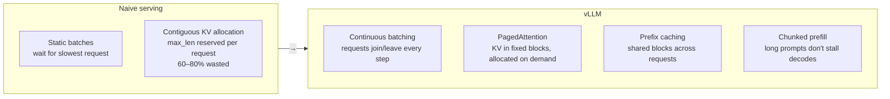
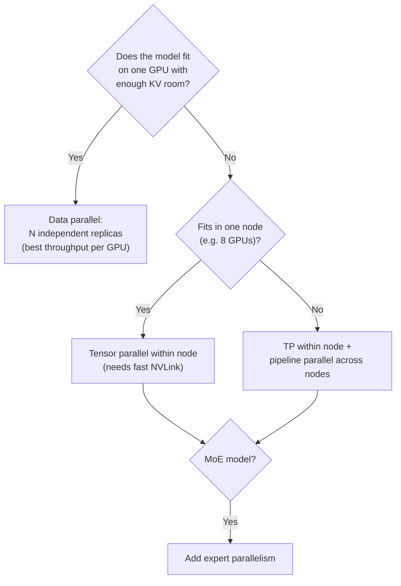
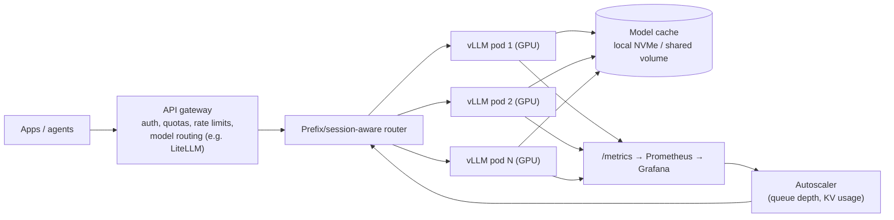
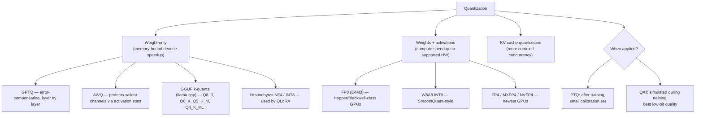
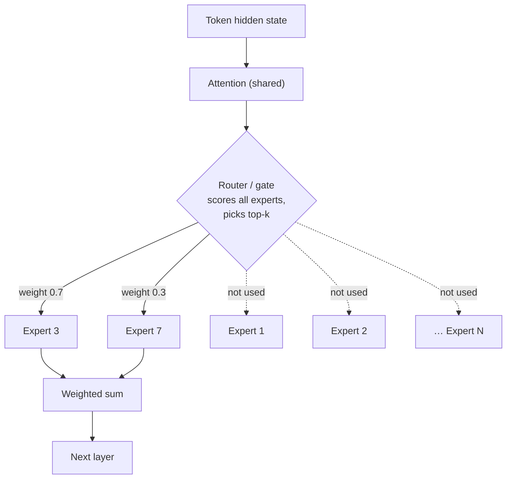
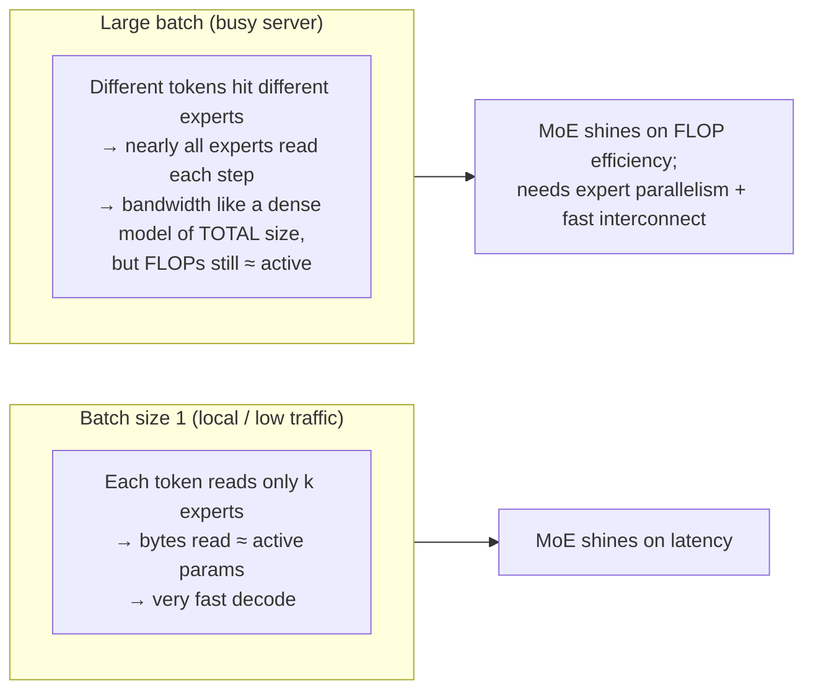
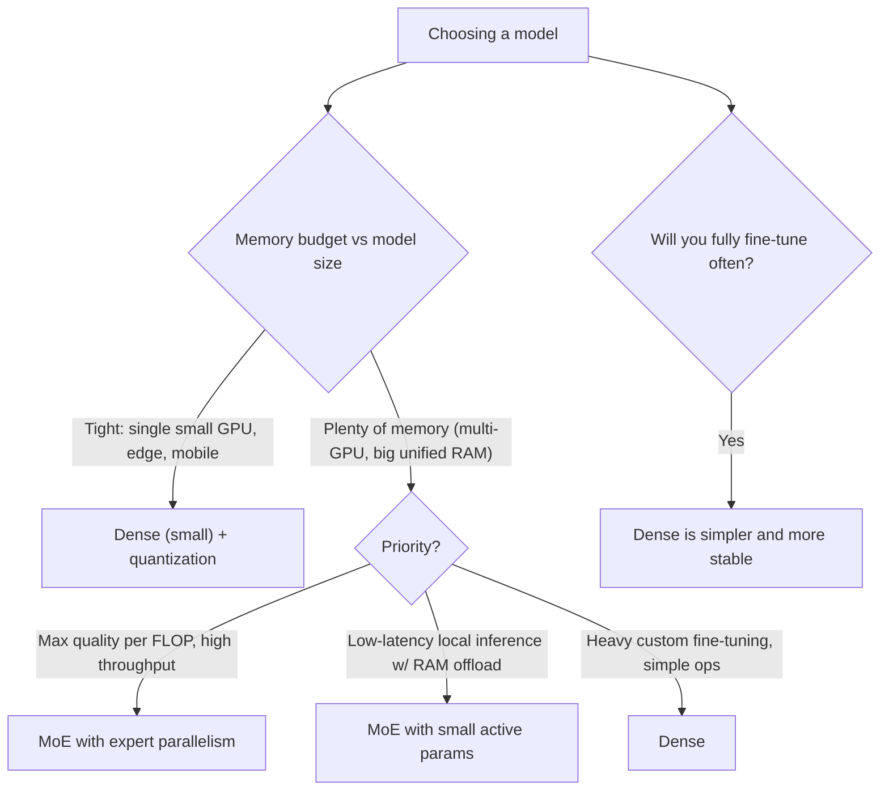

# Chapter 4 — Self-Hosting Models: vLLM, Quantization & MoE vs Dense

> Covers **Q8** (serving your own model with vLLM on-prem or cloud), **Q11** (quantization and estimating VRAM for a 7B Q8 model), and **Q12** (MoE vs dense — which to use when).

[← Back to index](../README.md)

---

## The one equation behind this whole chapter

$$
\text{GPU memory} \approx \underbrace{\text{weights}}_{\text{params} \times \text{bytes/param}} + \underbrace{\text{KV cache}}_{\text{tokens in flight} \times \text{bytes/token}} + \underbrace{\text{activations + runtime overhead}}_{\text{~1–4 GB}}
$$

$$
\text{KV bytes/token} = 2 \,(\text{K and V}) \times n_{\text{layers}} \times n_{\text{kv heads}} \times d_{\text{head}} \times \text{bytes/element}
$$

Quantization shrinks the first term. MoE changes how the first term relates to compute. vLLM's job is to pack the second term as tightly as possible.

---

## Q8. How do you serve your own model with vLLM (on-prem or cloud GPU)?

> **What's actually being asked:** Can you go beyond `vllm serve model-name`? Do you understand capacity planning (weights vs KV cache), the key flags, multi-GPU parallelism, production concerns (routing, autoscaling, metrics, cold starts, security), and how to benchmark?

### TL;DR

vLLM is a high-throughput inference engine (PagedAttention, continuous batching, prefix caching, chunked prefill) that exposes an **OpenAI-compatible API**. Run it as a container on GPU nodes, size `--max-model-len` and `--gpu-memory-utilization` from a KV-cache budget, use tensor parallelism inside a node, put a gateway + prefix-aware router in front, autoscale on queue depth, and benchmark with your real traffic shape.

### Why vLLM is fast (in one diagram)



### Step 1 — Capacity planning (do this before touching a GPU)

Example: **Qwen3-8B** (≈8.2B params, 36 layers, 8 KV heads, head dim 128) on one **80 GB** GPU, BF16.

| Item | Calculation | Result |
|---|---|---|
| Weights | 8.2B × 2 bytes | ~16.4 GB |
| KV per token | 2 × 36 × 8 × 128 × 2 bytes | 144 KiB |
| Usable memory | 80 GB × 0.90 utilization | 72 GB |
| KV budget | 72 − 16.4 − ~4 (activations/graphs) | ~51 GB |
| Tokens in flight | 51 GB ÷ 144 KiB | **~340K tokens** |
| Concurrency @ 4K tokens/request | 340K ÷ 4K | ~85 requests |
| Concurrency @ 32K tokens/request | 340K ÷ 32K | ~10 requests |

Levers if that's not enough: `--kv-cache-dtype fp8` (≈2× KV capacity), FP8/INT4 weights (frees memory for KV), lower `--max-model-len`, more GPUs.

### Step 2 — Run it

**Bare metal / VM:**

```bash
uv pip install vllm          # or: pip install vllm

vllm serve Qwen/Qwen3-8B \
  --host 0.0.0.0 --port 8000 \
  --api-key "$VLLM_API_KEY" \
  --served-model-name qwen3-8b \
  --max-model-len 32768 \
  --gpu-memory-utilization 0.90 \
  --max-num-seqs 128 \
  --enable-auto-tool-choice --tool-call-parser hermes \
  --reasoning-parser qwen3
```

**Docker (on-prem or cloud VM):**

```bash
docker run --gpus all --ipc=host -p 8000:8000 \
  -v /models/hf-cache:/root/.cache/huggingface \
  -e HF_TOKEN="$HF_TOKEN" \
  vllm/vllm-openai:<pinned-version> \
  --model Qwen/Qwen3-8B --served-model-name qwen3-8b \
  --max-model-len 32768 --gpu-memory-utilization 0.90 \
  --api-key "$VLLM_API_KEY"
```

**Use it with any OpenAI client:**

```python
from openai import OpenAI

client = OpenAI(base_url="http://gpu-node:8000/v1", api_key="...")
r = client.chat.completions.create(
    model="qwen3-8b",
    messages=[{"role": "user", "content": "Explain PagedAttention in two sentences."}],
    stream=True,
)
for chunk in r:
    print(chunk.choices[0].delta.content or "", end="")
```

### Key flags cheat sheet

| Flag | What it controls | Guidance |
|---|---|---|
| `--max-model-len` | Max context per request | Set to what you need, not the model's max — it bounds KV reservation |
| `--gpu-memory-utilization` | Fraction of VRAM vLLM may use | 0.85–0.92; lower if sharing the GPU |
| `--max-num-seqs` | Max concurrent sequences | Raise for throughput, lower for latency |
| `--max-num-batched-tokens` | Tokens per scheduler step | Higher = better prefill throughput; lower = smoother decode latency |
| `--tensor-parallel-size` | Split each layer across GPUs | Use within a node (NVLink ideally) |
| `--pipeline-parallel-size` | Split layers across GPUs/nodes | For models that don't fit one node |
| `--data-parallel-size` | Independent replicas | Scale throughput |
| `--enable-expert-parallel` | Shard MoE experts across GPUs | For large MoE models |
| `--quantization` / pre-quantized model | Weight precision (fp8, AWQ, GPTQ, …) | Prefer pre-quantized checkpoints |
| `--kv-cache-dtype fp8` | KV precision | ~2× KV capacity, small quality cost |
| `--enable-lora --lora-modules name=path` | Multi-LoRA serving | Many adapters on one base model |
| `--speculative-config '{...}'` | Speculative decoding | Lower latency at low batch sizes |

Flags evolve between releases — check `vllm serve --help` for your pinned version.

### Step 3 — Multi-GPU: which parallelism?



Rule of thumb: tensor parallelism over PCIe (no NVLink) often scales poorly — prefer more replicas of a quantized model over TP across PCIe.

### Step 4 — Production architecture



**On-prem checklist:**
- NVIDIA driver + container toolkit; pin vLLM image versions (CUDA compatibility matters).
- `--ipc=host` or a large `/dev/shm` for multi-GPU (NCCL uses shared memory).
- Air-gapped sites: pre-download weights (`hf download <repo>`), mount them, set `HF_HUB_OFFLINE=1`.
- Never expose vLLM directly — gateway handles auth, tenant quotas, logging, and PII policies.
- Avoid `--trust-remote-code` for unvetted repos (it executes model-repo Python code).

**Cloud checklist:**
- Kubernetes options: vLLM production-stack Helm chart, KServe, llm-d, Ray Serve, or managed GPU platforms.
- **Autoscale on `num_requests_waiting` and KV cache usage, not CPU.** CPU is meaningless for a GPU-bound server.
- **Cold starts** are dominated by weight loading (16 GB+). Keep a warm minimum replica, cache weights on local NVMe, use fast loaders/streamers, pre-pull images.
- Spot/preemptible GPUs work for batch jobs; use on-demand for latency-critical endpoints.

**Metrics to watch** (exact names vary by version): requests running/waiting, KV cache usage %, prefix cache hit rate, TTFT, inter-token latency, generation throughput, preemptions (KV pressure).

### Step 5 — Benchmark with your traffic shape

```bash
vllm bench serve \
  --model Qwen/Qwen3-8B --served-model-name qwen3-8b \
  --dataset-name random --random-input-len 2000 --random-output-len 300 \
  --num-prompts 500 --request-rate 8
```

Sweep request rate until p95 TTFT or inter-token latency breaks your SLO; that's your per-replica capacity. Agents (long inputs, short outputs, high prefix reuse) and chat (short inputs, long outputs) behave very differently — benchmark the one you actually run.

### If you have 30 seconds

> "I size it first: weights plus a KV budget — e.g., an 8B model in BF16 is ~16 GB, leaving ~50 GB on an 80 GB card for about 340K tokens of KV. Then `vllm serve` with an explicit max-model-len, memory utilization, tool and reasoning parsers, in a pinned container. Data-parallel replicas when the model fits on one GPU, tensor parallel within an NVLink node when it doesn't. In front: a gateway for auth and quotas and a prefix-aware router; autoscale on queue depth and KV usage; benchmark with my real input/output lengths."

---

## Q11. What is quantization? Given a 7B Q8 model, estimate the VRAM required.

> **What's actually being asked:** Do you know what quantization actually does numerically, the main families (weight-only vs weight+activation, PTQ vs QAT), and can you do back-of-the-envelope memory math *including the KV cache* — which is where most candidates stop too early?

### TL;DR

Quantization stores weights (and optionally activations/KV) in fewer bits — e.g., INT8 or 4-bit instead of 16-bit floats — using a scale factor per group of values. For a **7B model at Q8**: weights ≈ **7–7.5 GB** (1 byte/param + scale overhead) + KV cache (≈ **0.5 GB at 4K context** for a modern GQA model, ~2 GB for an older full-attention 7B) + **~0.5–1.5 GB** runtime overhead ⇒ **~8.5–10 GB at 4K context**, ~12 GB at 32K. Fits a 12 GB GPU for short contexts; 16 GB is comfortable.

### What quantization does

Map each float weight to a small integer with a shared scale:

$$
q = \text{round}\!\left(\frac{w}{s}\right),\quad \hat{w} = s \cdot q,\qquad s = \frac{\max |w_{\text{group}}|}{2^{b-1}-1}
$$

Example (symmetric INT8, one group): weights `[0.12, -0.50, 0.33, 0.04]` → max |w| = 0.50 → s = 0.50/127 ≈ 0.003937 → q = `[30, -127, 84, 10]` → dequantized `[0.118, -0.500, 0.331, 0.039]`. Small rounding error, half the memory of FP16.

**Granularity matters:** one scale per tensor is crude (one outlier ruins precision for everyone); per-channel or **per-group (e.g., 32–128 values)** keeps error low at the cost of storing more scales.

### The landscape



### Bytes per parameter (approximate)

| Format | Bits/weight (incl. scales) | 7B weights | Quality vs FP16 |
|---|---|---|---|
| FP16 / BF16 | 16 | 14.0 GB | Reference |
| FP8 / INT8 / GGUF Q8_0 | ~8–8.5 | 7.0–7.4 GB | Near-lossless |
| GGUF Q6_K | ~6.6 | ~5.7 GB | Very close |
| GGUF Q5_K_M | ~5.7 | ~5.0 GB | Close |
| GGUF Q4_K_M / AWQ / GPTQ 4-bit | ~4.5–4.9 | ~4.0–4.3 GB | Small, task-dependent drop |
| 3-bit and below | ≤3.5 | ≤3 GB | Noticeable degradation |

(GGUF Q8_0 stores blocks of 32 INT8 weights plus one FP16 scale → 34 bytes per 32 weights = 8.5 bits/weight.)

### The full VRAM estimate for "7B Q8"

**1. Weights:** 7 × 10⁹ × 8.5/8 bytes ≈ **7.4 GB** (if the "7B" is really 7.6B, as some are, ≈ 8.1 GB).

**2. KV cache** — depends on architecture and context:

| Architecture example | KV/token (FP16) | 4K ctx | 8K ctx | 32K ctx |
|---|---|---|---|---|
| Modern GQA 7–8B (32 layers, 8 KV heads, dim 128) | 128 KiB | 0.5 GiB | 1 GiB | 4 GiB |
| Older full multi-head 7B (32 layers, 32 KV heads) | 512 KiB | 2 GiB | 4 GiB | 16 GiB |

Multiply by concurrent sequences when serving multiple users. Quantizing KV to 8-bit halves these numbers.

**3. Runtime overhead:** CUDA context, compute buffers, framework: **~0.5–1.5 GB**.

**Total (single user, GQA model):**

| Context | Weights | KV | Overhead | **Total** | Fits |
|---|---|---|---|---|---|
| 4K | 7.4 | 0.5 | ~1 | **~9 GB** | 12 GB GPU ✅ |
| 8K | 7.4 | 1.0 | ~1 | **~9.5 GB** | 12 GB GPU ✅ |
| 32K | 7.4 | 4.0 | ~1 | **~12.5 GB** | 16 GB GPU ✅ |

Quick mental rule: **VRAM ≈ params(B) × bytes/param × 1.2 + KV cache**. For 7B Q8 → 7 × 1 × 1.2 ≈ 8.4 GB + KV.

**Fine-tuning is a different universe:** full fine-tuning with Adam needs ~16 bytes/param (weights + grads + two optimizer moments + master copy) ≈ 112 GB for 7B, before activations. That's why LoRA/QLoRA exist (Chapter 8).

### Practical guidance

- **Q8 / FP8:** default when it fits — essentially free quality-wise.
- **4-bit (AWQ/GPTQ/Q4_K_M):** when memory-bound or on consumer GPUs; evaluate on *your* tasks (reasoning, code, and non-English often degrade first).
- **Decode speed:** decode is memory-bandwidth-bound, so fewer bytes per weight ≈ faster tokens/sec at low batch sizes.
- **Always re-run your eval set** after quantizing; benchmark averages hide task-specific regressions.

### If you have 30 seconds

> "Quantization stores weights in fewer bits with per-group scale factors — INT8 maps each weight to round(w/s). For a 7B Q8 model: weights are about 7–7.5 GB including scales, KV cache is about 0.5 GB at 4K context for a GQA model — 2 × layers × KV heads × head dim × 2 bytes per token — plus about 1 GB runtime overhead. So roughly 9 GB at 4K and 12–13 GB at 32K, more with concurrent users. A 12 GB card works for short context; 16 GB is comfortable."

---

## Q12. MoE vs Dense — which one to use when?

> **What's actually being asked:** Do you understand the difference between **total** and **active** parameters, and how that splits memory cost from compute cost? Can you reason about batch size, hardware, latency, and fine-tuning trade-offs instead of saying "MoE is more efficient"?

### TL;DR

A **dense** model uses every parameter for every token. A **Mixture-of-Experts (MoE)** model replaces each FFN with many "expert" FFNs and a router that activates only the top-k per token. MoE gives **big-model quality at small-model compute**, but you must **store all the experts**. Choose MoE when you have memory but want fast/cheap tokens at scale (or CPU/unified-memory offload); choose dense when memory is tight, you need simple fine-tuning, or predictable single-GPU deployment.

### How MoE works



Training adds a **load-balancing loss** so tokens spread across experts (otherwise a few experts get everything — "router collapse"). Some designs add always-on **shared experts**.

### Total vs active parameters

| Model | Type | Total params | Active / token |
|---|---|---|---|
| Llama 3.1 8B | Dense | 8B | 8B |
| Qwen3-32B | Dense | 32B | 32B |
| Mixtral 8×7B | MoE | ~47B | ~13B |
| Qwen3-30B-A3B | MoE | ~30B | ~3B |
| gpt-oss-120b | MoE | ~117B | ~5B |
| DeepSeek-V3 | MoE | ~671B | ~37B |

- **Memory** scales with **total** params (all experts must be loaded).
- **Compute (FLOPs/token)** scales with **active** params.
- **Quality** typically lands between a dense model of the active size and one of the total size.

### The batch-size subtlety (where people get it wrong)



That's why MoE models with small active counts run surprisingly well on **CPU / unified-memory machines**: put attention + shared layers on GPU, offload expert weights to system RAM (llama.cpp supports offloading MoE expert tensors), and decode reads only a few experts per token.

### Decision guide



| Consideration | Dense | MoE |
|---|---|---|
| VRAM for given quality | Lower | Higher (store all experts) |
| FLOPs / token | Higher | Lower |
| Decode latency at batch 1 | Bound by total size | Bound by active size → fast |
| Serving at large scale | Simple TP/DP | Needs expert parallelism, all-to-all comms |
| Fine-tuning | Straightforward; LoRA works well | Harder (router stability, expert imbalance, memory); LoRA on attention/shared parts is common |
| Quantization | Well understood | Works well; experts quantize fine |
| Predictability | Uniform per-token cost | Load imbalance can create hot spots |
| Best for | Edge, single GPU, fine-tune-heavy shops | Frontier-quality serving, high-throughput APIs, RAM-offload local setups |

### If you have 30 seconds

> "MoE replaces each FFN with many experts and a router that activates top-k per token, so compute scales with active params but memory with total params. Dense uses everything for every token. I pick MoE when I have memory but want cheap, fast tokens — high-throughput serving with expert parallelism, or local inference with experts offloaded to RAM since only a few are read per token. I pick dense when memory is tight, on single small GPUs or edge, or when I'll do heavy fine-tuning, since dense is simpler to train and operate. And at large batch sizes, MoE reads nearly all experts anyway, so its advantage becomes FLOPs, not bandwidth."

---

## References

- vLLM documentation — serving, engine arguments, metrics, production-stack
- Kwon et al., *PagedAttention* (2023)
- Frantar et al., *GPTQ* (2022); Lin et al., *AWQ* (2023); Dettmers et al., *LLM.int8()* (2022)
- llama.cpp — GGUF quantization types
- Shazeer et al., *Outrageously Large Neural Networks: The Sparsely-Gated MoE Layer* (2017); Fedus et al., *Switch Transformers* (2021); Mixtral and DeepSeek-V3 technical reports

[← Chapter 3](03-document-ai-pdfs-tables-ocr.md) · [Next: Chapter 5 — Agent Runtime & Sandboxing →](05-agent-runtime-sandboxing.md)
