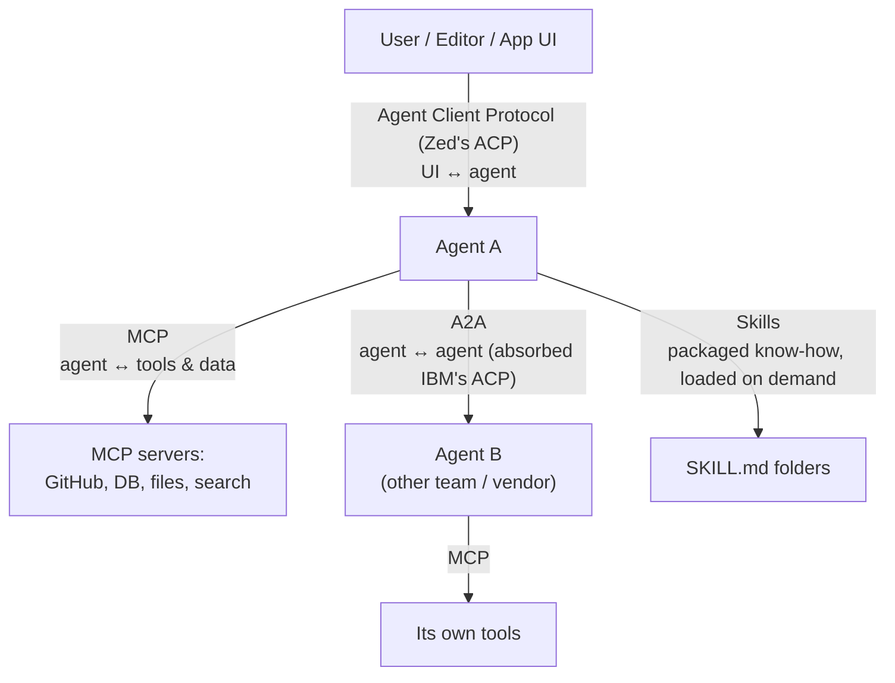
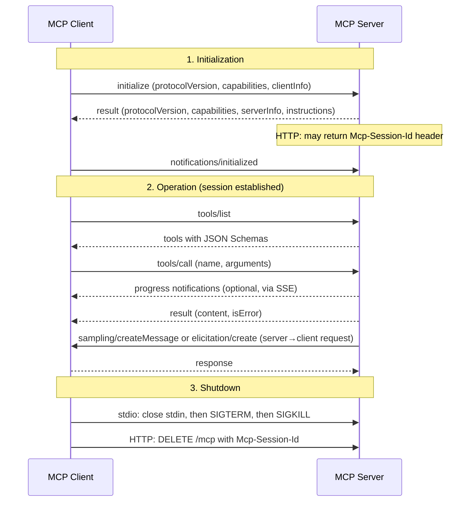
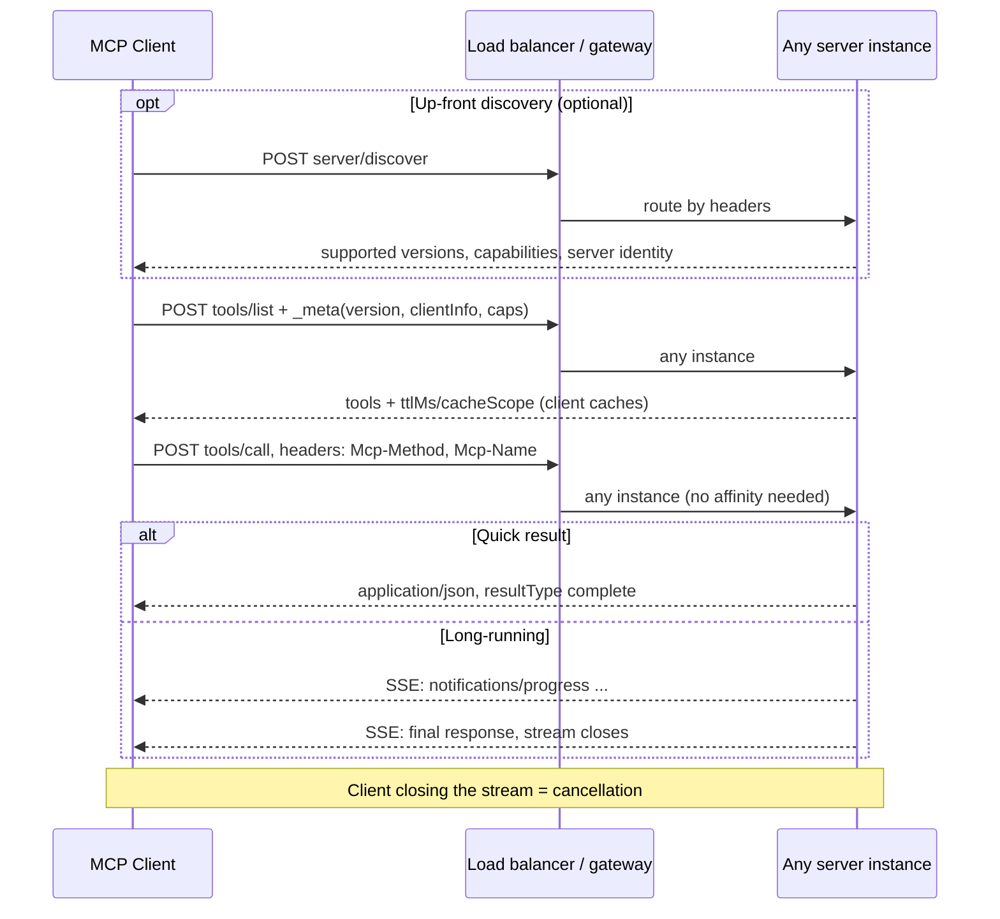
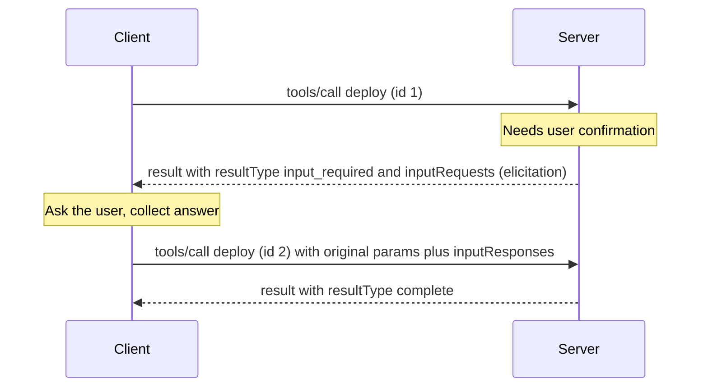
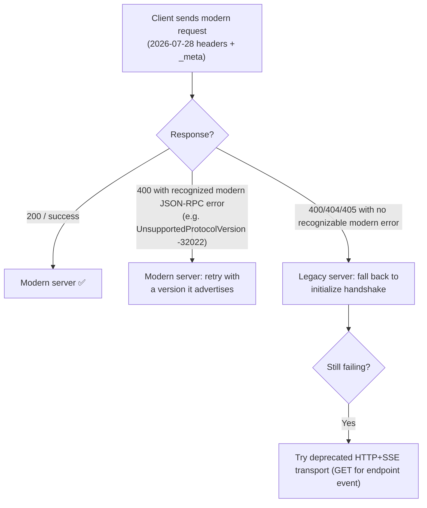
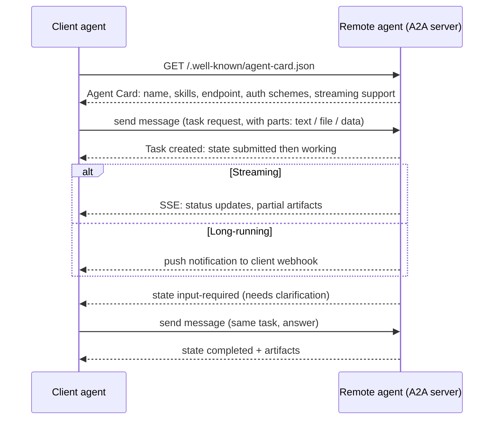
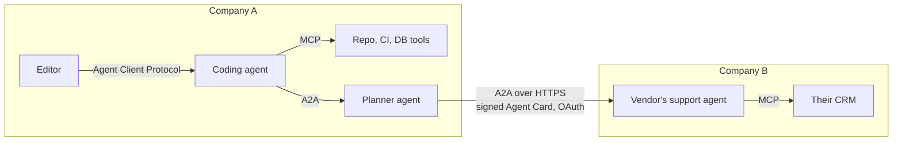
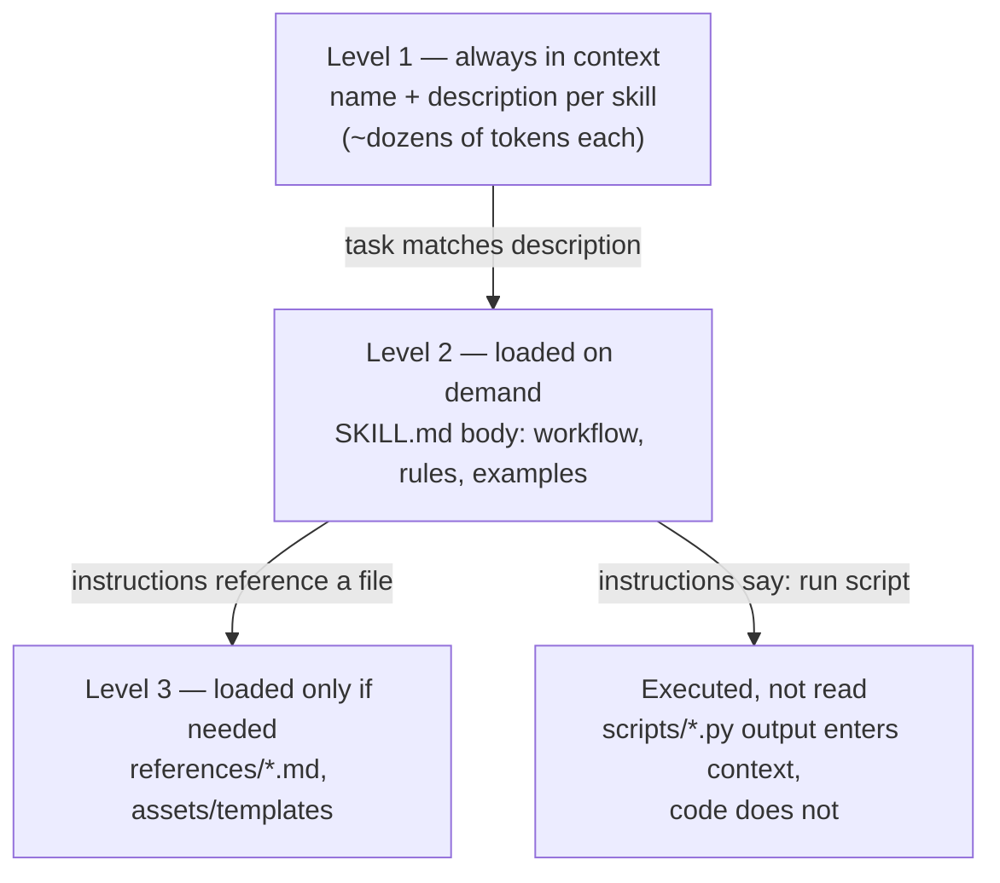

# Chapter 6 — Protocols & Extensibility: MCP, A2A vs ACP, Skills

> Covers **Q14** (MCP client–server handshake, request cycle, and termination), **Q15** (ACP vs A2A), and **Q17** (what Skills are and how to create custom ones).

[← Back to index](../README.md)

---

## The map: who talks to whom



| Layer | Standard | Analogy |
|---|---|---|
| Agent ↔ tools/data | **MCP** | USB-C for tools |
| Agent ↔ agent | **A2A** | HTTP between services that don't share internals |
| UI/editor ↔ agent | **Agent Client Protocol** | LSP, but for agents |
| Agent ↔ procedural knowledge | **Agent Skills** | An onboarding manual the agent opens when needed |

---

## Q14. MCP: client–server handshake, request cycle, and termination

> **What's actually being asked:** Do you know MCP at the wire level — JSON-RPC 2.0, transports, capability/version negotiation, how a tool call flows, how server-to-client requests work, how things end? **Bonus points in 2026:** knowing that the spec changed fundamentally in the `2026-07-28` revision (stateless core, no `initialize`).

### TL;DR

MCP is JSON-RPC 2.0 between a **client** (inside a host app/agent) and a **server** (exposing tools, resources, prompts), over **stdio** or **Streamable HTTP**.

- **Legacy era (2024-11-05 → 2025-11-25):** stateful. `initialize` → `notifications/initialized` → operations within a session (`Mcp-Session-Id` on HTTP) → shutdown (close stdin / HTTP `DELETE`).
- **Current spec (2026-07-28):** **stateless**. No handshake, no session. Every request carries protocol version, client info, and capabilities in `_meta`; `server/discover` advertises what the server supports; server→client needs (elicitation, sampling) use **Multi Round-Trip Requests**; a request ends when its response arrives, and **closing the response stream = cancellation**.

Most SDKs support both; many deployed servers still speak the legacy flow, so you need to understand both.

### Common foundations (both eras)

- **Message types:** request (`id` + `method` + `params`), response (`result` or `error`), notification (no `id`, no reply).
- **Server primitives:** `tools` (model-invoked functions), `resources` (readable data by URI), `prompts` (user-invoked templates).
- **Transports:**
  - **stdio** — the client launches the server as a subprocess; newline-delimited JSON-RPC over stdin/stdout; logs go to stderr.
  - **Streamable HTTP** — a single endpoint (e.g. `POST /mcp`); each response is either plain JSON or an SSE stream for that request.
- **Auth (HTTP):** OAuth 2.1-based; the MCP server acts as a protected resource.

### Era 1 — Legacy lifecycle (protocol versions up to 2025-11-25)



**Handshake messages:**

```jsonc
// client → server
{"jsonrpc": "2.0", "id": 1, "method": "initialize",
 "params": {
   "protocolVersion": "2025-11-25",
   "capabilities": {"roots": {"listChanged": true}, "sampling": {}, "elicitation": {}},
   "clientInfo": {"name": "my-agent", "version": "1.0.0"}}}

// server → client
{"jsonrpc": "2.0", "id": 1,
 "result": {
   "protocolVersion": "2025-11-25",
   "capabilities": {"tools": {"listChanged": true}, "resources": {"subscribe": true}, "prompts": {}},
   "serverInfo": {"name": "issue-tracker", "version": "2.3.0"},
   "instructions": "Use search_issues before create_issue to avoid duplicates."}}

// client → server (notification, no id)
{"jsonrpc": "2.0", "method": "notifications/initialized"}
```

Key rules: version negotiation (server answers with the client's version if supported, otherwise one it supports; client disconnects if incompatible), **capabilities gate features** (no `tools` capability → don't call `tools/list`), and only pings/logging before `initialized`.

**Termination:** stdio — client closes the server's stdin, waits, escalates to SIGTERM/SIGKILL. HTTP — client sends `DELETE` with the session id; if the server expires a session it returns 404 and the client must re-initialize. **Individual requests** are cancelled with `notifications/cancelled`.

**The scaling pain:** sessions meant sticky routing or shared session storage behind load balancers, and serverless deployments needed coordination for state that most calls never used. That's what the 2026 revision fixed.

### Era 2 — Current spec (2026-07-28): stateless MCP

What changed (from the official changelog):

- `initialize` / `notifications/initialized` **removed**; `Mcp-Session-Id` **removed**.
- Every request carries `io.modelcontextprotocol/protocolVersion`, `clientInfo`, and `clientCapabilities` in `params._meta`.
- On HTTP, required headers mirror the body: `MCP-Protocol-Version`, `Mcp-Method`, and `Mcp-Name` (for `tools/call`, `resources/read`, `prompts/get`) — so gateways can route/rate-limit without parsing JSON. Mismatch → `400` + `HeaderMismatch (-32020)`.
- New **`server/discover`** RPC (servers must implement) for up-front version/capability discovery.
- Server→client requests replaced by **Multi Round-Trip Requests (MRTR)**: the server returns an `input_required` result; the client retries the original request with the answers.
- Long-lived change notifications via **`subscriptions/listen`** (replaces the HTTP GET stream and `resources/subscribe`).
- **No stream resumability** (`Last-Event-ID` removed): a broken stream loses that request; re-issue it.
- `ping` and `logging/setLevel` removed; Roots, Sampling, and Logging features **deprecated**; tasks moved to an official extension.
- List results carry caching hints (`ttlMs`, `cacheScope`); servers should return `tools/list` in deterministic order (good for prompt caching — Chapter 1!).



**A modern request on the wire:**

```http
POST /mcp HTTP/1.1
Content-Type: application/json
Accept: application/json, text/event-stream
MCP-Protocol-Version: 2026-07-28
Mcp-Method: tools/call
Mcp-Name: search_issues

{"jsonrpc": "2.0", "id": 7, "method": "tools/call",
 "params": {
   "name": "search_issues",
   "arguments": {"query": "login timeout", "limit": 10},
   "_meta": {
     "io.modelcontextprotocol/protocolVersion": "2026-07-28",
     "io.modelcontextprotocol/clientInfo": {"name": "my-agent", "version": "2.0.0"},
     "io.modelcontextprotocol/clientCapabilities": {"elicitation": {}}}}}
```

**MRTR — when the server needs something from the client:**



Because each retry is self-contained, *any* server instance can handle it — no session state required. Servers that genuinely need cross-call state mint explicit **handles** passed as normal tool arguments.

**Termination in the stateless world:**
- **Request level:** a request ends when its final response is sent. On HTTP, **closing the SSE response stream is the cancellation signal** — the server should stop work and send nothing more. On stdio, `notifications/cancelled` is still used.
- **Subscription level:** close the `subscriptions/listen` stream.
- **Process level (stdio):** the client still owns the subprocess lifecycle — close stdin, then escalate signals if needed.
- **There's no session to delete.** Servers receiving legacy `GET`/`DELETE` should answer `405`.

### Backward compatibility in practice



### Production notes

- **Security:** validate `Origin` (DNS-rebinding protection), bind local servers to `127.0.0.1`, authenticate every request, scope tokens per server, and treat tool descriptions/results from third-party servers as untrusted (tool poisoning is a prompt-injection vector — Chapter 9).
- **Proxies:** send `X-Accel-Buffering: no` on SSE responses and emit keep-alive comment lines on long streams (Chapter 7).
- **Observability:** the spec documents propagating OpenTelemetry trace context through `_meta`.

### If you have 30 seconds

> "MCP is JSON-RPC 2.0 over stdio or Streamable HTTP. Up to the 2025-11-25 revision it was stateful: the client sends initialize with its protocol version, capabilities and info, the server replies with its own, the client sends notifications/initialized, then tools/list and tools/call run inside a session with an Mcp-Session-Id, and it ends by closing stdin or an HTTP DELETE. The 2026-07-28 revision made it stateless: no handshake or session — every request carries version, client info and capabilities in _meta, with Mcp-Method and Mcp-Name headers so load balancers can route; server/discover advertises capabilities; server-to-client needs use multi round-trip retries; and closing a request's stream is the cancellation. That makes MCP servers horizontally scalable like any HTTP API."

---

## Q15. ACP vs A2A

> **What's actually being asked:** Do you know the agent-protocol landscape well enough to (1) notice that "ACP" is ambiguous, (2) explain what A2A actually standardizes (discovery, tasks, streaming, auth), and (3) say when you'd use which — and how they relate to MCP?

### TL;DR

"ACP" means different things — **ask which one**:

1. **Agent Communication Protocol (IBM / BeeAI, March 2025):** a REST-based agent-to-agent protocol. In **August 2025 it merged into A2A** under the Linux Foundation; the team wound down ACP and contributes to A2A. Today: *use A2A*.
2. **Agent Client Protocol (Zed, August 2025):** a JSON-RPC protocol between **editors/UIs and coding agents** — "LSP for agents". Not a competitor to A2A; it's a different layer.
3. (Rarely in this context) **Agentic Commerce Protocol** — agent-initiated checkout with merchants.

**A2A (Agent2Agent)** — started by Google (April 2025), now under the Linux Foundation, **v1.0 in early 2026** — is *the* standard for agents talking to other agents across frameworks and organizations, treating each agent as an opaque service.

### A2A in one diagram



**Core concepts:**
- **Agent Card** — machine-readable profile at a well-known URL: identity, endpoint, skills, supported modalities, auth requirements. v1.0 adds **signed Agent Cards** so clients can verify a card was issued by the domain it claims.
- **Task** — the unit of work with a lifecycle (`submitted → working → input-required → completed / failed / canceled / rejected …`).
- **Message & Parts** — conversational turns made of typed parts (text, file, structured data).
- **Artifact** — the outputs a task produces.
- **Transport** — JSON-RPC 2.0 over HTTP(S), with additional bindings (gRPC, HTTP+JSON) in recent versions; streaming via SSE; async via push notifications (webhooks).
- **Security** — standard web auth (OAuth2/OIDC, API keys, mTLS) declared in the Agent Card; no new crypto inventions.
- **Opacity** — agents don't share memory, tools, or internal state. They collaborate through tasks and messages only.

### IBM's ACP (historical) vs A2A

| Aspect | IBM ACP (2025, merged) | A2A |
|---|---|---|
| Style | REST-native endpoints, simple `curl`-able | JSON-RPC 2.0 (+ other bindings) |
| Discovery | Agent manifests, including offline/embedded metadata | Agent Card at well-known URL (signed in v1.0) |
| Messages | Multipart, MIME-typed parts | Parts (text/file/data) |
| Execution | Sync, async, streaming runs | Tasks with lifecycle, SSE streaming, push notifications |
| Status | **Merged into A2A (Aug 2025)** | Active, v1.0 (2026), Linux Foundation |

### Zed's Agent Client Protocol vs A2A

| Aspect | Agent Client Protocol | A2A |
|---|---|---|
| Connects | Editor/UI ↔ coding agent | Agent ↔ agent |
| Typical transport | JSON-RPC over stdio (agent runs as editor subprocess) | JSON-RPC over HTTPS |
| Trust boundary | Same machine, same user | Cross-service, cross-org |
| Key features | Sessions, prompt turns, streamed updates (messages, tool calls, plans, diffs), permission requests to the user, editor-mediated file access | Discovery, task lifecycle, artifacts, async push, enterprise auth |
| Analogy | LSP | Service-to-service API |

### How they fit with MCP



- **MCP:** I control the tool; the model calls it with structured arguments; results return into my context.
- **A2A:** someone else's *agent* — with its own reasoning, tools, and policies — does a task for me and returns artifacts. I can't see inside.
- A common bridge: expose a remote A2A agent *as an MCP tool* to a local agent.

### If you have 30 seconds

> "First, which ACP? IBM's Agent Communication Protocol was a REST-based agent-to-agent protocol that merged into A2A in August 2025, so for agent-to-agent you build on A2A. Zed's Agent Client Protocol is a different layer — JSON-RPC between an editor and a coding agent, like LSP for agents. A2A, now v1.0 under the Linux Foundation, gives opaque agents discovery via signed Agent Cards, a task lifecycle with input-required states, typed message parts and artifacts, SSE streaming and push notifications, using standard web auth. MCP is agent-to-tool, A2A is agent-to-agent, Agent Client Protocol is UI-to-agent — they complement each other."

---

## Q17. What are Skills, and how do you create custom skills?

> **What's actually being asked:** Do you understand the *progressive disclosure* design that makes Skills cheap in context, how they differ from tools/MCP/system prompts/sub-agents, and can you author a good one (especially the description, which drives triggering)?

### TL;DR

A **Skill** is a folder containing a `SKILL.md` (YAML frontmatter with `name` + `description`, then Markdown instructions) plus optional `scripts/`, `references/`, and `assets/`. Introduced by Anthropic and published as an **open standard (agentskills.io, December 2025)**, now supported by many agent products. Agents see only each skill's name and description up front, load the full `SKILL.md` when a task matches, and open bundled files or run scripts only when needed — so you can install dozens of skills with minimal context cost.

### Progressive disclosure



This is why skills need an environment with a **filesystem and code execution**: the agent literally reads files and runs scripts.

### Skills vs everything else

| Mechanism | What it provides | Context cost | Best for |
|---|---|---|---|
| System prompt | Always-on instructions | Always paid | Identity, global rules |
| Tool / function | A callable action | Schema always present | Atomic operations |
| MCP server | Tools + data from external systems | Schemas always present (unless deferred) | Connecting to systems |
| **Skill** | Procedural know-how + scripts + templates | Tiny until used | Repeatable workflows, house styles, domain procedures |
| Sub-agent | A separate context and loop | Separate window | Isolating big explorations |

Rule of thumb: **MCP gives the agent hands; Skills teach it how to use them well.**

### Anatomy

```text
pdf-table-extraction/
├── SKILL.md                  # required
├── scripts/
│   ├── classify_pages.py     # deterministic helpers the agent runs
│   └── extract_tables.py
├── references/
│   ├── stitching-rules.md    # detail loaded only if needed
│   └── validation.md
└── assets/
    └── output_schema.json
```

### Example `SKILL.md`

```markdown
---
name: pdf-table-extraction
description: Extract tables from PDF reports (financial statements, annexures,
  multi-page tables) into clean CSV/Parquet with validation. Use when the user
  asks to pull tables, numbers, or line items out of a PDF, or to analyze
  tabular data contained in a PDF.
---

# PDF Table Extraction

## Workflow
1. Run `python scripts/classify_pages.py <pdf>` to label pages digital/scanned.
2. Digital pages: `python scripts/extract_tables.py <pdf> --pages <list> --out out/`
3. Scanned pages: render at 200 DPI (300 if text < 8pt) and use the OCR tool,
   asking for HTML tables with rowspan/colspan.
4. Stitch tables that continue across pages — see `references/stitching-rules.md`.
5. Validate before answering — see `references/validation.md`.
   Never report numbers from a table that fails the total-row check
   without flagging it.

## Output
- One CSV per logical table, named `<page_start>-<page_end>_<slug>.csv`
- A summary listing each table, its pages, row count, and validation status.

## Gotchas
- Parenthesized numbers are negatives: (1,200) -> -1200
- Repeated header rows on continuation pages must be dropped, not kept as data.
```

### How to create a good skill — step by step

1. **Start from a real, repeated task.** Do it manually with the agent first; notice what you keep re-explaining (formats, gotchas, steps).
2. **Write the description as a trigger.** It's the *only* thing the agent sees before deciding. Say *what it does* **and** *when to use it*, with the words users actually say ("pull tables", "line items", "financial statements").
3. **Keep `SKILL.md` lean** (the spec recommends under ~500 lines). Put long reference material in `references/`, one level deep, and tell the agent *when* to open each file.
4. **Move fragile or deterministic work into scripts.** Parsing, validation, file conversions — code is more reliable than instructions and costs no context to "run".
5. **Write for the agent, not a human novice.** Skip what the model already knows; focus on your organization's specifics, decisions, and failure modes.
6. **Test triggering and behaviour:** prompts that *should* trigger, prompts that *shouldn't*, and check outputs. Iterate on the description first — most skill failures are "didn't trigger" or "triggered when it shouldn't".
7. **Version and share** via your repo (e.g., `.claude/skills/`, or the equivalent directory for your agent), plugins, or your platform's skills API.

### Implementing skills in your own agent

The pattern is simple enough to build into any agent with file and shell tools:

```python
import pathlib, yaml

def load_skill_index(skills_dir: str) -> list[dict]:
    index = []
    for skill_md in pathlib.Path(skills_dir).glob("*/SKILL.md"):
        text = skill_md.read_text()
        _, fm, _body = text.split("---", 2)          # frontmatter between first two ---
        meta = yaml.safe_load(fm)
        index.append({"name": meta["name"], "description": meta["description"],
                      "path": str(skill_md)})
    return index

def skills_system_block(index: list[dict]) -> str:
    lines = ["You have these skills. When a task matches a description, read the",
             "SKILL.md at the given path with read_file BEFORE doing the task.", ""]
    lines += [f"- {s['name']}: {s['description']} (path: {s['path']})" for s in index]
    return "\n".join(lines)

# Put skills_system_block(...) in the (cached!) system prompt.
# The agent's existing read_file / bash tools do the rest.
```

### Security

Skills can contain instructions and executable scripts — a malicious skill is a prompt injection plus code execution. Install only from trusted sources, review scripts like any dependency, run them in a sandbox (Chapter 5), and pin versions.

### If you have 30 seconds

> "A skill is a folder with a SKILL.md — YAML frontmatter with name and description, then instructions — plus optional scripts, references, and assets. It's an open standard now supported across many agents. The key is progressive disclosure: only names and descriptions sit in context; the agent reads the full SKILL.md when a task matches, opens reference files only if needed, and runs scripts without loading their code. To build one: capture a repeated workflow, write the description as a precise trigger saying what and when, keep the body lean, push deterministic work into scripts, and test both triggering and outputs. MCP gives agents tools; skills teach them procedures."

---

## References

- MCP specification — `2026-07-28` changelog and Streamable HTTP transport; `2025-11-25` lifecycle (legacy)
- A2A protocol specification v1.0 (a2a-protocol.org); LF AI & Data announcement on ACP joining A2A (Aug 2025)
- Agent Client Protocol documentation (Zed)
- Agent Skills specification (agentskills.io); Anthropic engineering blog on Agent Skills

[← Chapter 5](05-agent-runtime-sandboxing.md) · [Next: Chapter 7 — Scaling Agents on the Web →](07-scaling-agents-sse-runtimes.md)
