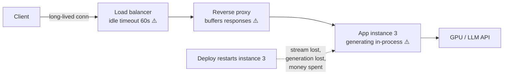
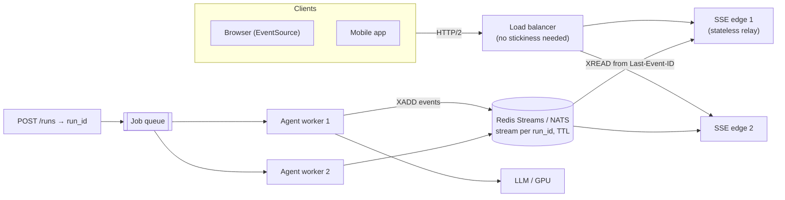
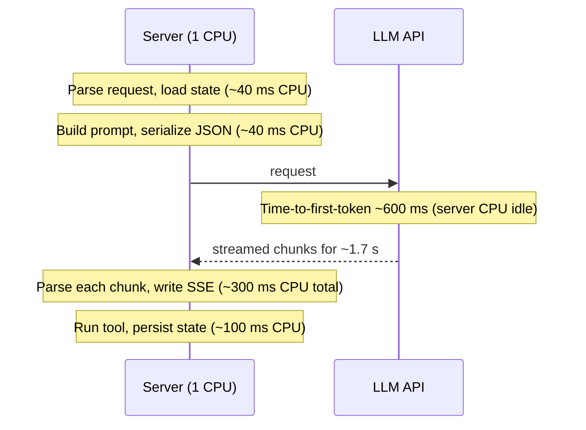
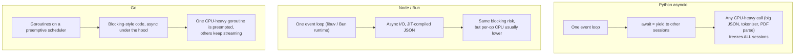
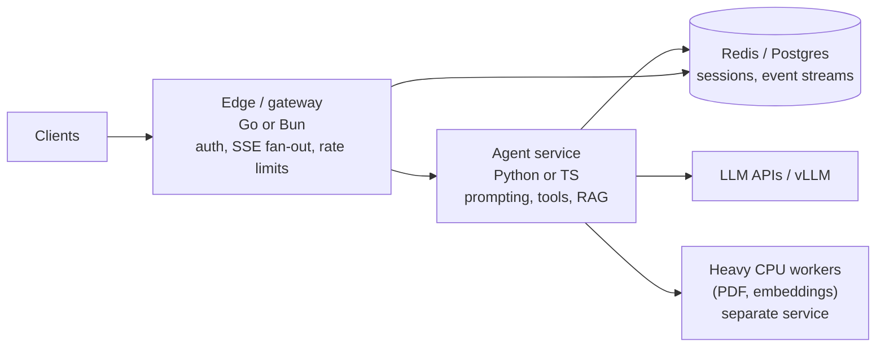

# Chapter 7 — Scaling Agents on the Web: SSE & Runtime Choice

> Covers **Q13** (Server-Sent Events and how to scale them) and **Q16** (Python vs TypeScript/Bun vs Go for web-facing agents — memory and throughput bottlenecks on a single-CPU server).

[← Back to index](../README.md)

---

## Q13. SSE — how do you scale it?

> **What's actually being asked:** SSE looks trivial (`text/event-stream`, write `data:` lines), but LLM streams are long-lived, slow, and expensive to restart. Can you handle proxies, timeouts, reconnection/resume, horizontal scaling, backpressure, deploys, and cancelling GPU work when the user leaves?

### TL;DR

Decouple **generation** from **delivery**. Workers write events (tokens, tool calls, status) to a durable stream (Redis Streams, NATS JetStream, Kafka) keyed by run id; stateless SSE edge nodes subscribe and relay. Use event `id`s so clients resume with `Last-Event-ID`, send heartbeats every ~15 s, disable proxy buffering, raise idle timeouts, serve over HTTP/2, drain connections gracefully on deploys, and cancel upstream generation when nobody is listening.

### SSE basics

```http
HTTP/1.1 200 OK
Content-Type: text/event-stream
Cache-Control: no-cache
X-Accel-Buffering: no

retry: 3000

id: 1730-0
event: token
data: {"t": "Hello"}

id: 1730-1
event: token
data: {"t": " world"}

: keep-alive comment (ignored by clients)

id: 1731-0
event: done
data: {"finish_reason": "stop"}
```

- One-directional (server → client) over plain HTTP; the browser `EventSource` reconnects automatically and sends `Last-Event-ID`.
- Text only; one event = lines ending with a blank line.

| | SSE | WebSocket | Long polling |
|---|---|---|---|
| Direction | Server → client | Bidirectional | Request/response |
| Proxy/CDN friendliness | High (plain HTTP) | Medium (upgrade) | High |
| Auto reconnect + resume | Built-in (`Last-Event-ID`) | DIY | DIY |
| Best for | LLM token streams, progress, notifications | Collaborative editing, voice, games | Fallback |

### Why naive SSE breaks at scale



1. **Buffering:** proxies (nginx etc.) and compression buffer the response → tokens arrive in bursts or at the end.
2. **Idle timeouts:** load balancers and proxies close "quiet" connections (often after 60 s) during long tool calls.
3. **In-process generation:** if the instance holding the connection dies (deploy, crash, scale-in), both the stream and the generation are lost; a reconnect may land on a different instance that knows nothing.
4. **Browser connection limits:** over HTTP/1.1, browsers allow ~6 connections per origin — multiple tabs with SSE can starve other requests.
5. **Slow clients:** a mobile client on a bad network can't keep up; unbounded buffers grow memory.
6. **Orphaned work:** the user closes the tab, but you keep paying for generation.

### The scalable architecture



- `POST /runs` creates the run and returns `run_id` immediately; workers execute it.
- Clients `GET /runs/{id}/events`; any edge node can serve it because events live in the shared stream.
- Reconnects resume exactly where they left off; deploys of edge nodes don't lose generation.
- Multiple viewers (second tab, a teammate) can watch the same run.

### Edge relay with resume + heartbeats (FastAPI + Redis Streams)

```python
import json
from fastapi import FastAPI, Request
from fastapi.responses import StreamingResponse
import redis.asyncio as redis

app = FastAPI()
r = redis.Redis()

def sse(event_id: str, event: str, data: str) -> str:
    return f"id: {event_id}\nevent: {event}\ndata: {data}\n\n"

@app.get("/runs/{run_id}/events")
async def run_events(run_id: str, request: Request):
    key = f"run:{run_id}:events"
    last_id = request.headers.get("last-event-id", "0-0")   # resume point

    async def gen():
        nonlocal last_id
        yield "retry: 3000\n\n"
        while not await request.is_disconnected():
            await r.set(f"run:{run_id}:viewer", "1", ex=45)   # presence heartbeat
            # wait up to 15s for new events; otherwise send a heartbeat
            res = await r.xread({key: last_id}, block=15_000, count=200)
            if not res:
                yield ": ping\n\n"
                continue
            for _stream, entries in res:
                for entry_id, fields in entries:
                    last_id = entry_id.decode()
                    event = fields[b"event"].decode()
                    yield sse(last_id, event, fields[b"data"].decode())
                    if event == "done":
                        return

    return StreamingResponse(gen(), media_type="text/event-stream",
                             headers={"Cache-Control": "no-cache",
                                      "X-Accel-Buffering": "no"})
```

**Worker side:**

```python
async def run_agent(run_id: str, task):
    key = f"run:{run_id}:events"
    async for ev in agent_loop(task):                    # tokens, tool calls, status
        await r.xadd(key, {"event": ev.type, "data": json.dumps(ev.payload)},
                     maxlen=20_000, approximate=True)    # bounded memory
        if not await r.exists(f"run:{run_id}:viewer"):    # nobody watching for 45s+
            # (in production: allow a grace period after start / background runs)
            await r.xadd(key, {"event": "done", "data": '{"cancelled": true}'})
            return
    await r.xadd(key, {"event": "done", "data": "{}"})
    await r.expire(key, 3600)                            # replay window, then GC
```

### Infrastructure settings

```nginx
location /runs/ {
    proxy_pass         http://sse_edges;
    proxy_http_version 1.1;
    proxy_set_header   Connection "";
    proxy_buffering    off;          # deliver each event immediately
    proxy_cache        off;
    proxy_read_timeout 1h;           # long streams
    gzip               off;          # compression buffers small chunks
}
```

- **Load balancer idle timeout** > heartbeat interval (e.g., heartbeat 15 s, idle timeout 120 s+).
- **HTTP/2 end-to-end** where possible (multiplexes many streams over one connection, avoids the 6-connection limit).
- **OS limits:** raise file-descriptor limits (`ulimit -n`), tune `somaxconn`, watch ephemeral ports on proxies.
- **Graceful deploys:** on SIGTERM, stop accepting new streams, send a final event telling clients to reconnect, then close; clients resume elsewhere via `Last-Event-ID`.
- **Backpressure:** bounded per-connection queues; if a client falls too far behind, drop it and let it resume from the stream (that's what the stream is for).
- **Auth:** `EventSource` can't set custom headers — use cookies or a short-lived signed token in the URL (and keep it out of logs), or use `fetch()` streaming with headers.

### Capacity intuition

An idle SSE connection on an async server costs a file descriptor plus a few KB to tens of KB of memory. Tens of thousands of concurrent streams per node is realistic for async runtimes; the usual limits are memory, file descriptors, and the load balancer — not CPU. The expensive part is the *generation*, which is why decoupling and orphan-cancellation matter more than squeezing connection counts.

### If you have 30 seconds

> "I decouple generation from delivery: workers append events to a durable per-run stream like Redis Streams with ids; stateless SSE edge nodes relay from the client's Last-Event-ID, so reconnects and deploys resume seamlessly and no stickiness is needed. Then the operational basics: disable proxy buffering and compression, heartbeats every ~15 seconds under LB idle timeouts, HTTP/2, high fd limits, bounded per-client buffers, graceful draining, and cancelling upstream generation when no one has been listening for a while."

---

## Q16. Python vs TypeScript (Bun) vs Go for web agents — memory and throughput bottlenecks on a 1-CPU server

> **What's actually being asked:** Can you reason about *where an agent server actually spends resources*? Agents mostly wait on LLM APIs (I/O), so raw language speed matters less than the concurrency model, per-session memory, and CPU spent on JSON/streaming/TLS. On one CPU there's no parallelism to hide behind — event-loop blocking and memory per session decide your ceiling.

### TL;DR

- **The real bottlenecks:** (1) memory per concurrent session (conversation state, buffers, SDK objects), (2) CPU per request spent on JSON (de)serialization, validation, token streaming, and TLS, (3) anything that blocks the single event loop/core.
- **Python (asyncio):** best AI ecosystem; fine for I/O-bound concurrency; highest memory per object; easy to accidentally block the loop with CPU work. Good for the agent *brain*.
- **TypeScript on Bun (or Node):** single-threaded event loop with fast JIT'd JSON; great streaming/web ergonomics and agent SDKs; lower per-connection overhead than Python; Bun adds fast startup and a quick built-in HTTP server.
- **Go:** goroutines + compiled code + compact memory; the most headroom for thousands of concurrent streams on one core; thinner (but adequate) AI ecosystem. Great for gateways, relays, and high-fan-out services.
- **The bigger win than language choice:** keep agent state *out of process* (Redis/Postgres), make the server a stateless relay, and stream instead of buffering.

### Where a web agent's time actually goes



The CPU segments are short but **every concurrent session needs them on the same single core**. Waiting is cheap in every modern runtime; CPU and memory are not.

### Concurrency models on one core



### Comparison (orders of magnitude — benchmark your own stack)

| Dimension | Python (FastAPI/uvicorn) | TypeScript on Bun | TypeScript on Node | Go (net/http) |
|---|---|---|---|---|
| Baseline process RSS | Highest (tens of MB, more with ML libs) | Low–medium | Medium | Lowest (~10–20 MB) |
| Memory per idle connection | Highest | Low | Low–medium | Lowest (goroutine stacks start at a few KB) |
| JSON throughput | Slow in pure Python; good with `orjson` / pydantic-core | Fast | Fast | Fast (faster with codegen libs) |
| Blocking risk on 1 CPU | High (CPU work freezes loop) | Medium | Medium | Low (preemptive scheduler) |
| Cold start | Slow (imports) | Very fast | Fast | Very fast (static binary) |
| AI/ML ecosystem | Best (local models, data, eval tooling) | Strong for LLM apps + web/streaming UIs | Strong | Adequate (official API SDKs, MCP SDK) |
| Typical role | Agent logic, RAG, data tools | Full-stack agent apps, edge streaming | Same | Gateways, SSE relays, proxies, high-fan-out workers |

### Napkin math for a 1-CPU, 2 GB server

Memory ceiling ≈ (RAM − runtime baseline) ÷ (per-session memory).

| Per-session footprint | Dominated by | Concurrent sessions in ~1.5 GB |
|---|---|---|
| ~50 KB (state external, stream relay only) | Runtime + buffers | ~30,000 (fd/LB limits hit first) |
| ~1 MB (history kept in memory) | Conversation objects | ~1,500 |
| ~10 MB (history + parsed docs + SDK objects in Python) | Data, not language | ~150 |

Notice: once you hold conversation history and documents in memory, **your data model dominates** — a Go server holding 10 MB per session isn't much better than Python holding 10 MB. Externalize state first; then language overhead matters.

CPU ceiling ≈ 1 core-second ÷ (CPU-ms per session-second). If each active stream costs 0.5 ms of CPU per second (parsing chunks, writing SSE), one core handles ~2,000 actively-streaming sessions *if nothing blocks*. One 200 ms JSON parse of a giant tool result stalls everyone for 200 ms — measure **event-loop lag**, not just averages.

### Language-specific survival tips

**Python**
- `uvloop`, `orjson`, pooled `httpx.AsyncClient` (one client, reused), pydantic v2.
- Never do CPU-heavy work (PDF parsing, local tokenization of huge texts, pandas) in the request loop — on 1 CPU, push it to a separate worker service.
- Watch for sync SDK calls inside async handlers (silent loop blockers).
- Monitor loop lag (e.g., a periodic task that measures its own scheduling delay).

**TypeScript (Bun / Node)**
- Stream with `ReadableStream` / async iterators; avoid accumulating whole responses.
- Large `JSON.parse` blocks the loop — cap tool-result sizes, stream-parse where possible.
- Node: set heap limits consciously; Bun: verify compatibility of any Node-native deps you rely on.

**Go**
- Set `GOMEMLIMIT` to keep GC behaviour predictable under a memory cap; recent Go versions are container-aware for `GOMAXPROCS`.
- Use `context.Context` cancellation end-to-end (client disconnect → cancel the upstream LLM request).
- Use `http.Flusher` for SSE; bounded channels for backpressure.

### Recommended architecture (mix, don't marry)



- Small team, mostly web product → **TypeScript end-to-end** (Bun or Node) is a strong default.
- ML-heavy logic (local models, data science tooling) → **Python** for the agent service, with discipline about blocking.
- Connection-heavy edge (thousands of concurrent streams per box, tight memory) → **Go** (or Bun) relay in front.

### How to decide with data (not vibes)

Build a 1-day benchmark: a mock LLM that waits 500 ms then streams 300 tokens over 5 s; your real tool payload sizes; ramp concurrent sessions with `k6`/`oha` on a 1-vCPU box. Record RSS, p99 event-loop lag / scheduling delay, p99 inter-event latency, and the session count where p99 breaches your SLO. Run it for each candidate runtime with **your** framework and SDKs.

### If you have 30 seconds

> "Web agents are I/O-bound — mostly waiting on the LLM — so on one CPU the bottlenecks are memory per session and CPU spent on JSON, streaming and TLS, plus anything that blocks the event loop. Python has the best AI ecosystem but the highest memory per object and is easy to block with CPU work; TypeScript on Bun or Node has fast JSON and great streaming ergonomics; Go has the lowest memory and a preemptive scheduler, so it's best for high-concurrency gateways. But the biggest win is architectural: keep state external, stream instead of buffer, offload heavy CPU work. I'd typically run a Go or Bun edge for SSE fan-out and Python or TS for agent logic — and benchmark with a mock LLM before committing."

---

## References

- WHATWG HTML Standard — Server-sent events
- Redis Streams documentation (`XADD`, `XREAD`); NATS JetStream documentation
- nginx `proxy_buffering` / `X-Accel-Buffering` documentation
- Python `asyncio` docs (debug mode, slow callback detection); Bun and Node.js documentation; Go `net/http`, `runtime` (`GOMEMLIMIT`) docs

[← Chapter 6](06-protocols-mcp-a2a-acp-skills.md) · [Next: Chapter 8 — Fine-tuning →](08-fine-tuning-lora-qlora-moa.md)
