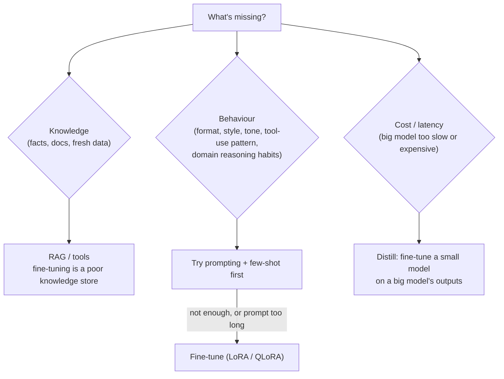
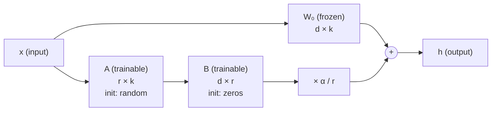
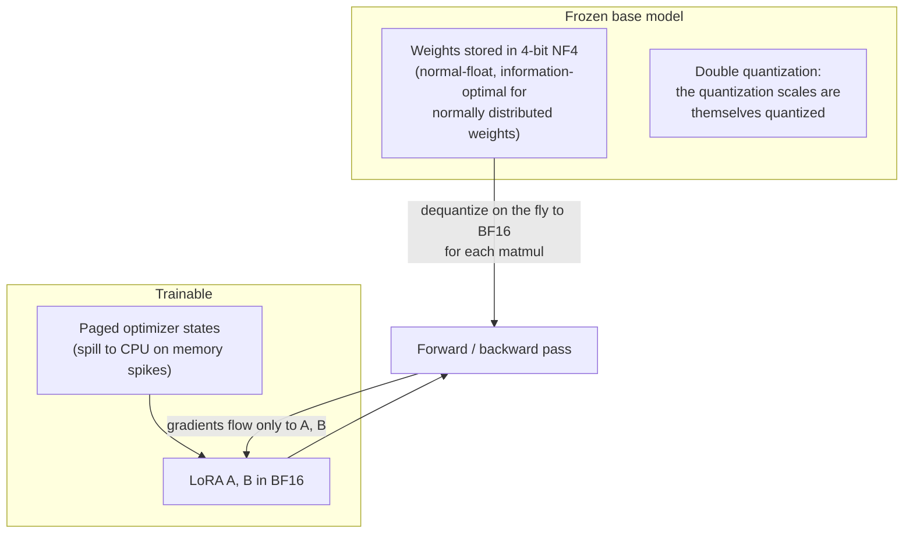
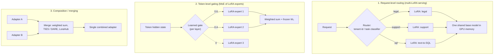

# Chapter 8 — Parameter-Efficient Fine-Tuning: LoRA, QLoRA & Mixture of Adapters

> Covers **Q19** (LoRA, QLoRA fine-tuning, and mixture of adapters).

[← Back to index](../README.md)

---

## First: should you fine-tune at all?



Fine-tuning changes **how** a model behaves far more reliably than **what** it knows. If the gap is knowledge, start with retrieval.

---

## Q19. LoRA, QLoRA, and Mixture of Adapters

> **What's actually being asked:** Do you understand *why* low-rank adaptation works and its math, the memory story that makes QLoRA possible on one GPU, the practical knobs (rank, alpha, target modules, learning rate), deployment (merge vs hot-swap, multi-LoRA serving), and the ways to combine many adapters?

### TL;DR

- **LoRA** freezes the pretrained weights and learns a low-rank update $\Delta W = BA$ for selected matrices. Trains ~0.1–1% of parameters, needs far less memory, and can be merged back into the weights (zero inference overhead) or hot-swapped.
- **QLoRA** does the same on top of a **4-bit quantized frozen base** (NF4 + double quantization + paged optimizers), so a 7B model fine-tunes in well under 16 GB and much larger models fit on a single big GPU.
- **Mixture of adapters** uses multiple LoRA adapters together: route each **request** to the right adapter (multi-LoRA serving), route each **token** through learned gates (MoE-style LoRA experts), or **merge** adapters into one.

### LoRA — the idea

Full fine-tuning learns an update $\Delta W$ the same size as $W$ (e.g., 4096 × 4096 = 16.8M numbers per matrix). Empirically, useful task updates have **low intrinsic rank**, so approximate:

$$
h = W_0 x + \Delta W x = W_0 x + \frac{\alpha}{r} B A x, \qquad B \in \mathbb{R}^{d \times r},\; A \in \mathbb{R}^{r \times k},\; r \ll \min(d, k)
$$



- **B starts at zero**, so at step 0 the model is exactly the base model — training starts from a known-good point.
- **α/r scaling** keeps the update magnitude stable as you change rank.
- **Parameter count per matrix:** $r(d + k)$. For 4096 × 4096 at r = 16: 131K vs 16.8M → **0.78%**.
- **Whole model:** applying r = 16 to all linear layers (q, k, v, o, gate, up, down) of a Llama-2-7B-style model ≈ **40M trainable params (~0.6%)**.

**Deployment options:**
- **Merge:** $W = W_0 + \frac{\alpha}{r}BA$ → a normal model, zero extra latency.
- **Keep separate:** a few tens of MB per adapter; swap per request; serve many adapters on one base (see Mixture of Adapters).

### Memory: why PEFT matters

Rough training memory for a **7B** model (excluding activations, which depend on sequence length and batch size):

| Method | Frozen base | Trainable state (weights + grads + Adam) | Typical total with activations* |
|---|---|---|---|
| Full fine-tune (BF16 mixed precision + Adam) | — | ~16 bytes/param × 7B ≈ **112 GB** | 120 GB+ (multi-GPU) |
| LoRA (BF16 base) | ~14 GB | ~40M × ~16 bytes ≈ 0.6 GB | ~18–28 GB |
| **QLoRA (4-bit NF4 base)** | **~4 GB** | ~0.6 GB | **~6–12 GB** |

\*With gradient checkpointing and moderate sequence lengths (≈1–2K). Long sequences raise activation memory substantially.

### QLoRA — three tricks



1. **NF4 4-bit storage** for the frozen base — ~4× smaller than BF16.
2. **Double quantization** — saves roughly another ~0.4 bits/param on the scale factors.
3. **Paged optimizers** — avoid out-of-memory crashes from gradient-checkpointing spikes.

Compute happens in BF16 (weights are dequantized per layer on the fly), so QLoRA is **slower per step** than LoRA on a BF16 base — you trade speed for memory. Quality is typically close to 16-bit LoRA.

### QLoRA in code (Hugging Face stack)

```python
import torch
from transformers import AutoModelForCausalLM, AutoTokenizer, BitsAndBytesConfig
from peft import LoraConfig, get_peft_model, prepare_model_for_kbit_training
from trl import SFTConfig, SFTTrainer

BASE = "your-base-model"

bnb = BitsAndBytesConfig(
    load_in_4bit=True,
    bnb_4bit_quant_type="nf4",
    bnb_4bit_use_double_quant=True,
    bnb_4bit_compute_dtype=torch.bfloat16,
)
model = AutoModelForCausalLM.from_pretrained(BASE, quantization_config=bnb, device_map="auto")
model = prepare_model_for_kbit_training(model)        # grad checkpointing, stable norms

lora = LoraConfig(
    r=16, lora_alpha=32, lora_dropout=0.05,
    target_modules="all-linear",                       # q,k,v,o + MLP projections
    task_type="CAUSAL_LM",
)
model = get_peft_model(model, lora)
model.print_trainable_parameters()                     # sanity check: well under 1%

trainer = SFTTrainer(
    model=model,
    train_dataset=train_ds,                            # chat-formatted examples
    eval_dataset=eval_ds,
    args=SFTConfig(
        output_dir="out/qlora",
        learning_rate=2e-4, lr_scheduler_type="cosine", warmup_ratio=0.03,
        per_device_train_batch_size=4, gradient_accumulation_steps=4,
        num_train_epochs=2, bf16=True,
        optim="paged_adamw_8bit",
        logging_steps=10, eval_strategy="steps", eval_steps=100,
    ),
)
trainer.train()
model.save_pretrained("out/qlora/adapter")             # tens of MB
```

**Merging a QLoRA adapter:** reload the base in **BF16** (not 4-bit), load the adapter, call `merge_and_unload()`, then quantize the merged model for serving if needed. Merging into the 4-bit weights directly loses precision.

### Hyperparameter starting points

| Knob | Starting point | Notes |
|---|---|---|
| Rank `r` | 8–32 | Higher for complex behaviour shifts; diminishing returns beyond ~64 for most tasks |
| `lora_alpha` | r or 2r | Effective scale is α/r (or α/√r with rsLoRA) |
| Target modules | All linear layers | Attention-only is cheaper but usually weaker |
| Learning rate | 1e-4 – 2e-4 | ~10× higher than full fine-tuning |
| Dropout | 0–0.1 | More for small datasets |
| Epochs | 1–3 | Watch eval loss; overfitting shows fast on small data |
| Data | 1K–10K high-quality examples | Quality and diversity beat volume for behaviour tuning |

**Useful variants:** DoRA (separates magnitude and direction of updates), rsLoRA (rank-stabilized scaling for higher ranks), LoRA+ (different learning rates for A and B), PiSSA (initialize from principal singular components).

### Evaluate like you mean it

- A held-out set from the **target task** (exact-match / rubric / LLM-as-judge with spot checks).
- A **regression set** of general capabilities and safety behaviours — LoRA reduces but doesn't eliminate catastrophic forgetting.
- Compare against the **prompted base model** — if few-shot prompting gets within a few points, you may not need the fine-tune.

---

### Mixture of Adapters

Once you have several adapters (per task, per customer, per domain), there are three main ways to use them together:



**1. Request-level routing — multi-LoRA serving.** One base model in memory; hundreds of adapters loaded/swapped on demand; each request specifies (or a router chooses) its adapter. Systems like S-LoRA and Punica showed how to batch requests that use *different* adapters efficiently; vLLM supports this (`--enable-lora`, adapters exposed as model names). Great for **multi-tenant SaaS** (one adapter per customer) and **multi-task products**.

```bash
vllm serve your-base-model --enable-lora \
  --lora-modules legal=/adapters/legal support=/adapters/support sql=/adapters/sql \
  --max-loras 8 --max-lora-rank 32
# client chooses: model="legal" | "support" | "sql"
```

**2. Token-level gating — LoRA experts inside the model.** Several LoRA "experts" per layer plus a small trainable router, trained jointly (research lines include MoLoRA, LoRAMoE, MixLoRA, X-LoRA). The model mixes skills *within* a single response and suffers less interference than one adapter trained on everything. Costs: more complex training (load balancing, router stability) and serving support is less standard.

**3. Composition / merging.** Combine adapters without routing at inference: weighted averaging, task arithmetic, TIES/DARE (resolve sign conflicts / sparsify before merging), LoraHub (learn mixing weights from a few examples), or AdapterFusion-style learned combination. Cheap to serve (one adapter), but merged skills can interfere.

| Approach | Inference cost | Training complexity | Best for |
|---|---|---|---|
| Request-level routing | ~Base model + small adapter overhead | Low (train adapters independently) | Multi-tenant, clearly separable tasks |
| Token-level gating | Slightly higher (several experts active) | High | Mixed-skill requests, multi-domain assistants |
| Merging | Same as one adapter | Low–medium | Combining a few compatible skills cheaply |

### If you have 30 seconds

> "LoRA freezes the base weights and learns a low-rank update BA scaled by alpha over r — B starts at zero, so training starts from the base model — training well under 1% of parameters, and it can be merged with no inference overhead or kept as a swappable adapter. QLoRA stores the frozen base in 4-bit NF4 with double-quantized scales and uses paged optimizers, so a 7B model trains in roughly 6–12 GB; compute still happens in BF16, so it's slower per step but close in quality. Mixture of adapters means using many adapters together: route each request to its adapter with multi-LoRA serving, gate per token across LoRA experts MoE-style, or merge adapters with methods like TIES. And I only fine-tune for behaviour, format, or distillation — knowledge goes in RAG."

---

## References

- Hu et al., *LoRA: Low-Rank Adaptation of Large Language Models* (2021)
- Dettmers et al., *QLoRA: Efficient Finetuning of Quantized LLMs* (2023)
- Sheng et al., *S-LoRA* (2023); Chen et al., *Punica* (2023)
- Liu et al., *DoRA* (2024); Kalajdzievski, *rsLoRA* (2023); Hayou et al., *LoRA+* (2024)
- Huang et al., *LoraHub* (2023); Yadav et al., *TIES-Merging* (2023); Pfeiffer et al., *AdapterFusion* (2021)
- Hugging Face PEFT and TRL documentation

[← Chapter 7](07-scaling-agents-sse-runtimes.md) · [Next: Chapter 9 — Security, Privacy & Ethics →](09-security-privacy-ethics.md)
