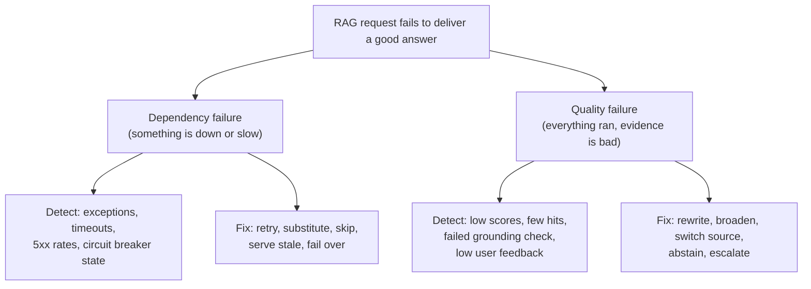
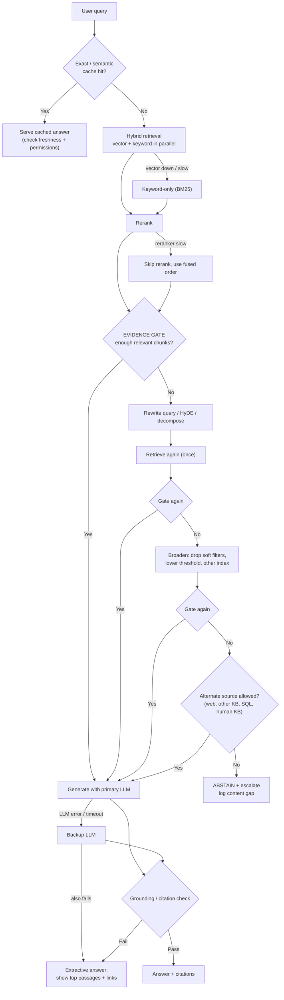
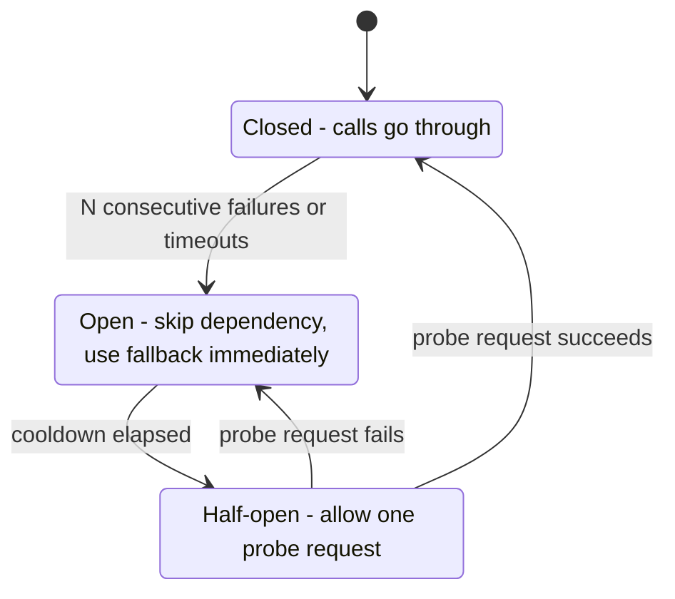
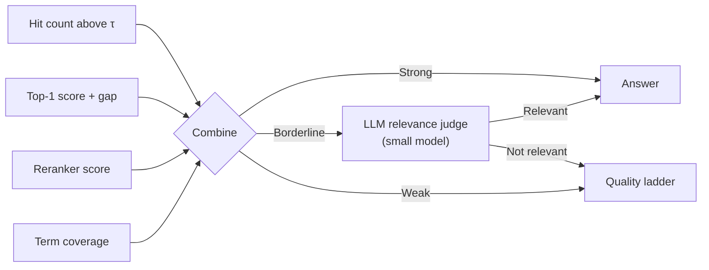

# Chapter 10 — RAG in Production: Fallback Strategy

> Covers **Q21** (what a production fallback strategy for RAG looks like).

[← Back to index](../README.md)

---

## Q21. What is the production fallback strategy for RAG?

> **What's actually being asked:** A demo RAG pipeline has one happy path. A production one must answer: *what happens when retrieval returns nothing useful, when the vector DB is down, when the reranker is slow, when the LLM times out, when the answer isn't grounded?* Can you separate **dependency failures** from **quality failures**, define a **degradation ladder** with explicit triggers, and make sure the user gets an honest, useful response at every rung — instead of a stack trace, a hallucination, or a 30-second spinner?

### TL;DR

A good RAG fallback strategy has two halves:

1. **Dependency fallbacks (infrastructure):** every external call (vector DB, keyword index, embedding service, reranker, LLM) gets a **timeout, retry budget, and circuit breaker**, plus a *cheaper substitute*: vector → keyword search, reranker → skip, primary LLM → backup model → extractive answer.
2. **Quality fallbacks (evidence):** after retrieval, an **evidence gate** decides whether what you found is good enough to answer from. If not, climb a ladder: **rewrite query → broaden search → alternate source → abstain** ("I couldn't find this") and escalate to a human, rather than letting the LLM improvise.

Wrap both in a **total latency budget**, **honest user messaging**, **fallback-rate metrics**, and a feedback loop that turns "couldn't answer" into content fixes.

> **Core principle: degrade gracefully, never silently.** Every fallback should be (a) triggered by a measurable signal, (b) cheaper or safer than the failure it replaces, (c) visible in traces, and (d) honest to the user.

---

### Two kinds of failure — different detection, different fix



Teams usually build the first and forget the second. But the more dangerous production failure is **a confident answer built on irrelevant chunks** — nothing crashed, so no alert fired.

---

### The full pipeline with fallbacks



---

### Part A — Dependency fallbacks

Give every component a **timeout, a breaker, and a substitute**:

| Component | Typical failure | Fallback | User impact |
|---|---|---|---|
| **Vector DB** | Down, slow, node failover | Read replica → **keyword (BM25) search** → serve cached results for popular queries | Slightly lower recall; usually unnoticeable |
| **Keyword index** | Down | Vector-only | Misses exact-match terms (IDs, codes, names) |
| **Embedding service** (query-time) | Timeout, rate limit | Embedding cache for repeated queries → **BM25 only**. ⚠️ Do **not** swap to a different embedding model against an existing index — vectors from different models aren't comparable | Lower recall |
| **Reranker** | Slow, down | **Skip it** and use fused retrieval order | Slightly lower precision |
| **Query rewriter** | Slow | Use the original query | Fewer rescues for weak queries |
| **Primary LLM** | 429 / 5xx / timeout | **Backup provider or smaller model** (same prompt format tested in advance) | Possibly lower quality or style differences |
| **All LLMs** | Outage | **Extractive answer**: show top passages with titles and links | No synthesis, but still useful |
| **Web / external source** | Slow | Skip; continue ladder | None |

**Mechanics that make these fallbacks safe:**

- **Timeouts per stage**, derived from a **total latency budget** (see below). A missing timeout turns a slow dependency into a full outage via request pile-up.
- **Retries with exponential backoff + jitter**, limited to 1–2 attempts and only for idempotent calls; retrying inside a tight budget often makes things worse.
- **Circuit breakers:** after N consecutive failures, stop calling the dependency for a cooldown period and go straight to the fallback. This protects the failing service and your latency.



- **Hedged requests** (for tail latency): if the primary hasn't answered within, say, p95 latency, fire the same request at a replica/backup and take the first result.
- **Bulkheads:** separate connection pools / rate limits per dependency so one slow service can't starve the others.
- **Stale-while-error:** if the index is unreachable, serve cached results marked with their age rather than nothing.

#### Latency budget (illustrative, 8 s end-to-end target)

| Stage | Timeout | If exceeded |
|---|---|---|
| Cache lookup | 50 ms | Treat as miss |
| Query rewrite / embedding | 500 ms – 1 s | Use original query / BM25 only |
| Vector search | 1 s | Keyword-only |
| Keyword search | 0.5 s | Vector-only |
| Rerank | 1 s | Skip |
| LLM generation (first token) | 3–6 s | Backup LLM |
| Grounding check | 1 s | Return with lower-confidence flag, or extractive |
| **Total** | **8 s** | Return best-so-far: extractive passages + "taking longer than expected" |

The ladder must never exceed the **total** budget just because each rung is individually reasonable. Track the remaining budget and skip optional rungs (rewrite, rerank) when it's nearly spent.

---

### Part B — Quality fallbacks: the evidence gate

The gate is the single most important component. It answers: **"Do I have enough relevant evidence to answer from?"** — *before* the LLM gets a chance to improvise.

**Signals you can combine** (cheapest first):

| Signal | How | Watch out for |
|---|---|---|
| Number of results above a threshold | `count(score ≥ τ) ≥ k_min` | Scores aren't comparable across embedding models, retrievers, or indexes — **calibrate τ per retriever** on labelled queries |
| Top-1 score and **score gap** | A clear winner vs. a flat list of mediocre hits | Flat distributions often mean "nothing relevant" |
| **Reranker score** | Cross-encoder relevance is better calibrated than raw cosine | Still needs calibration |
| Query–chunk **term coverage** | Do key entities/numbers from the query appear in the evidence? | Great for IDs, product names, dates |
| **LLM relevance judge** (CRAG-style "correct / ambiguous / incorrect") | Small, fast model grades each chunk | Adds latency and cost; use on borderline cases only |
| **Self-check at generation** | Model is asked to output `NOT_ENOUGH_INFO` when context doesn't answer | Models under-use this unless prompted and tested |
| Retrieval **disagreement** | Vector and keyword return disjoint top results | Often signals a vague or out-of-domain query |



**Calibrating the gate:** collect a few hundred real queries, label whether the corpus contains an answer, and sweep thresholds. Choose the operating point by the cost asymmetry:

- **High-stakes domains (legal, medical, finance):** favour precision of "answer" — accept more abstentions.
- **Low-stakes support/search:** favour recall — accept occasional weak answers with caveats and citations.

### The quality ladder, rung by rung

| Rung | Action | When it helps | Cost |
|---|---|---|---|
| **1. Rewrite** | LLM rewrites the query (expand abbreviations, resolve "it/that" from chat history), or generate a hypothetical answer (HyDE), or decompose multi-part questions | Vague, conversational, or jargon-mismatched queries | +1 small LLM call |
| **2. Broaden** | Drop *soft* filters (date range, category), lower threshold, increase top-k, search sibling indexes, add keyword leg | Over-filtered queries | Retrieval only |
| **3. Alternate source** | Another knowledge base, structured data (SQL), a different language index, or **web search** | Question is valid but outside the primary corpus | Latency + trust risk |
| **4. Parametric fallback** (rarely) | Answer from the model's own knowledge, **clearly labelled** as "not from your documents" | Low-stakes general questions only | Hallucination risk |
| **5. Abstain + escalate** | "I couldn't find this in [source]." Offer related documents, a human handoff, or a ticket | Everything else | Cheapest, safest |

**Hard rules for rungs 2–4:**

- **Never widen past permissions.** Broadening must keep ACL/tenant filters; "drop filters" applies to *relevance* filters only. Leaking another tenant's document to avoid an abstention is a security incident.
- **Web results are untrusted input** — treat them as potential prompt-injection carriers (Chapter 9) and label them in citations.
- **Retry once, not forever.** Each rung is bounded; the ladder always terminates.
- **Parametric fallback is a policy decision**, not a default. Disable it in regulated domains.

### Generation-side checks

Even with good evidence, the model can drift. Add a last gate:

- **Citation check:** every claim sentence should map to a retrieved chunk; reject answers citing IDs that weren't in context.
- **Entailment / faithfulness check:** a small NLI model or LLM judge verifies "is this answer supported by the context?" (use sampling in production if cost-sensitive).
- **Numeric check:** numbers and dates in the answer must appear in the evidence.
- **On failure:** regenerate once with a stricter prompt ("answer only from the passages; say if they don't contain the answer"), then fall back to the **extractive answer**.

### Honest user experience at each rung

| Mode | What to show |
|---|---|
| Normal | Answer with citations |
| Degraded (backup model / no rerank) | Usually identical UI; log silently |
| Weak evidence, answered | Answer + "Based on limited information in [doc]" + citations |
| Extractive | "Here are the most relevant passages" + links |
| Alternate source | Badge: "From the web — not verified against your documents" |
| Abstain | "I couldn't find this." + closest documents + "Ask a human" button |
| Timeout | Best-so-far passages + "taking longer than expected" |

Never present a fallback answer with the same confidence as a grounded one.

---

### Caching as a fallback layer

- **Exact-match cache** for repeated queries (cheapest, safest).
- **Semantic cache** (embedding similarity on queries) — high hit rate but risky: near-duplicates can have different answers ("refund within 30 days" vs "within 14 days"). Use a high similarity threshold, scope by tenant/permissions, and invalidate on document updates.
- **Stale-while-error:** serve the last good answer for a popular query if live retrieval fails, with a freshness label.
- Remember the prompt-caching economics from Chapter 1: keep system prompt and tool definitions byte-stable so fallback to a retry doesn't also mean a cold prefix.

---

### Observability: measure fallbacks as first-class events

Log, per request: which rungs fired, why, latency per stage, retrieval scores, gate decision, final mode (`grounded`, `grounded_backup_llm`, `extractive`, `abstain`, …).

| Metric | Why it matters | Alert when |
|---|---|---|
| Fallback rate by type | A rising dependency fallback rate = infra trouble | Sudden jump or sustained above baseline |
| Abstention rate | Content gaps or a broken retriever | Spike (retriever regression) or sustained high (corpus gaps) |
| Rewrite rescue rate | How often rung 1 turns a weak query into a good one | Falling = rewriter degraded |
| Gate precision/recall (offline, labelled) | Is the threshold still right after reindexing? | Drift after embedding/index changes |
| Grounding-check fail rate | Hallucination pressure | Rising after prompt/model changes |
| p95 latency by mode | Fallbacks should be *faster*, not slower | Degraded modes slower than normal |
| User feedback (thumbs, re-asks, escalations) | Ground truth for silent quality failures | Down-trend |

**Close the loop:** cluster abstained queries weekly → missing documents, bad chunking, synonym gaps, or stale content. This is how fallbacks improve the system instead of just hiding its problems.

**Test the fallbacks.** Chaos-test them: kill the vector DB, inject 10 s reranker latency, return 429 from the LLM, feed out-of-domain queries — and assert the final **mode** and user message. Fallback code that's never exercised is broken code.

---

### Reference implementation (tested)

`code/rag_fallback.py` implements the ladder above with stubs and runs seven failure scenarios as assertions. Key excerpts:

**Guard every dependency: timeout + circuit breaker, return `None` instead of raising**

```python
async def guarded(name, breaker, fn, timeout, trace):
    if not breaker.allow():
        trace.append(f"{name}: skipped (circuit open)")
        return None
    try:
        out = await asyncio.wait_for(fn(), timeout)
        breaker.record(True)
        return out
    except Exception as e:                     # includes timeouts
        breaker.record(False)
        trace.append(f"{name}: failed ({type(e).__name__})")
        return None
```

**Retrieval degrades instead of failing**

```python
v, k = await asyncio.gather(
    guarded("vector",  self.br["vector"],  lambda: self.vector(q, broaden), 1.0, trace),
    guarded("keyword", self.br["keyword"], lambda: self.keyword(q, broaden), 0.5, trace))
docs = fuse([v or [], k or []])                         # one leg missing is fine
r = await guarded("rerank", self.br["rerank"], lambda: self.rerank(q, docs), 1.0, trace)
docs = r if r is not None else docs                     # reranker is optional
```

**Evidence gate → ladder → abstain**

```python
good = self._good(await self._retrieve(q, False, trace))
if len(good) < self.min_docs:                           # weak evidence -> rewrite
    q2 = await guarded("rewrite", ...)
    good = self._good(await self._retrieve(q2, False, trace))
if len(good) < self.min_docs:                           # still weak -> broaden
    good = self._good(await self._retrieve(q, True, trace))
if len(good) < self.min_docs:
    return Answer("I couldn't find this in the available documents...", "abstain", ...)
```

**Generation ladder**

```python
text = await guarded("llm", ...)                        # primary
if text is None: text = await guarded("backup_llm", ...)
if text is None: text = "Relevant passages:\n" + "\n".join(f"- {d.text}" for d in ctx)  # extractive
```

**Observed behaviour from the test run:**

| Scenario | Final mode | Trace |
|---|---|---|
| Normal | `grounded` | — |
| Vector DB down | `grounded` | `vector: failed (ConnectionError)` |
| Reranker too slow | `grounded` | `rerank: failed (TimeoutError)` |
| Weak query ("how do I get my money back") | `grounded` | gate → rewrite rescues it |
| Not in corpus | `abstain` | gate → rewrite → broaden → abstain |
| Primary LLM down | `grounded_backup_llm` | `llm: failed` |
| Both LLMs down | `extractive` | `llm` and `backup_llm` failed |

(The demo's relevance score is a toy token-overlap measure. In production, use calibrated retriever/reranker scores as described above.)

---

### Common mistakes

1. **No evidence gate** — the LLM always gets *something* and always answers confidently.
2. **Falling back to a different embedding model on the same index** — silent garbage retrieval.
3. **Retry storms** — every layer retries, multiplying load on a struggling dependency. Retry at one layer, with jitter and a budget.
4. **Unbounded ladders** — rewrite → broaden → rewrite … with no total budget.
5. **Broadening past access control** to avoid abstaining.
6. **Hiding fallbacks from users and from dashboards.**
7. **Semantic cache without permission/tenant scoping** — cross-user answer leakage.
8. **Untested backup LLM** — different tokenizer, tool-call format, or context limit breaks the pipeline exactly when you need it.
9. **Thresholds set once** and never recalibrated after re-embedding or re-chunking.

### If you have 30 seconds

> "I split failures into dependency failures and quality failures. For dependencies, every call has a timeout, retry budget and circuit breaker with a cheaper substitute — vector search falls back to BM25, the reranker gets skipped, the primary LLM falls back to a backup model and finally to an extractive answer of top passages — all inside a total latency budget. For quality, an evidence gate checks scores, hit counts, reranker confidence and term coverage before generation; if it fails I climb a bounded ladder — rewrite the query, broaden filters without crossing permissions, optionally an alternate source — and otherwise abstain and escalate rather than let the model guess. A grounding check catches unsupported answers. Every fallback is logged, labelled honestly to the user, chaos-tested, and abstained queries feed back into content fixes."

---

## References

- Yan et al., *Corrective Retrieval Augmented Generation (CRAG)* (2024)
- Asai et al., *Self-RAG: Learning to Retrieve, Generate, and Critique through Self-Reflection* (2023)
- Gao et al., *Precise Zero-Shot Dense Retrieval without Relevance Labels (HyDE)* (2022)
- Cormack et al., *Reciprocal Rank Fusion outperforms Condorcet and individual rank learning methods* (2009)
- Nygard, *Release It!* — circuit breaker, bulkhead, and timeout patterns
- RAG evaluation tooling documentation (e.g., Ragas, TruLens, DeepEval) for faithfulness and context-relevance metrics

[← Chapter 9](09-security-privacy-ethics.md) · [Back to index →](../README.md)
